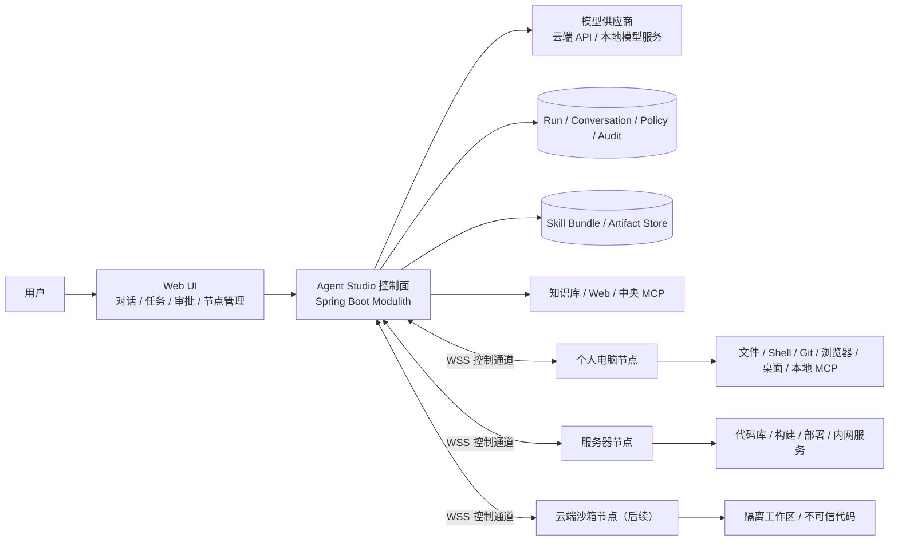
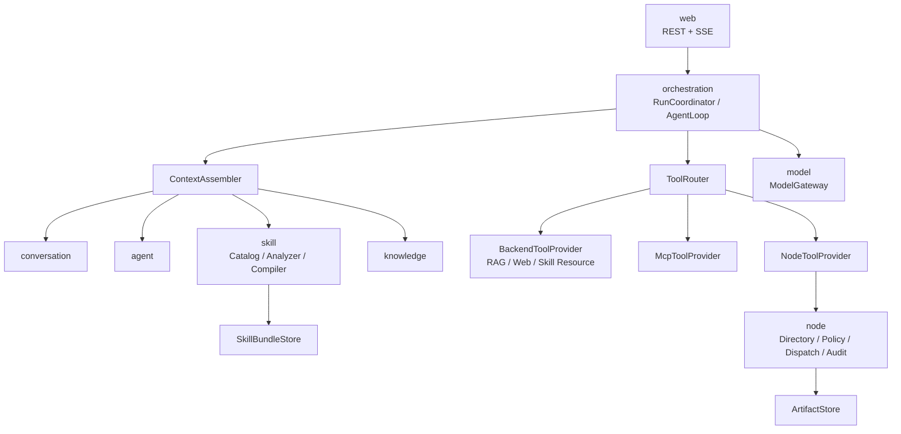
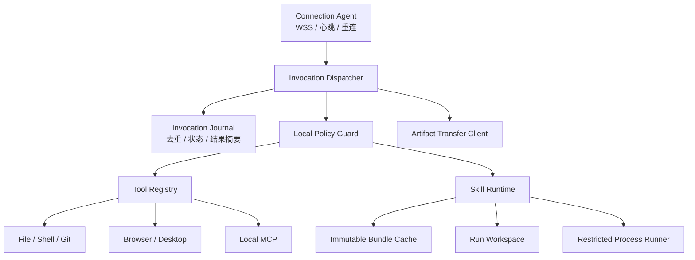
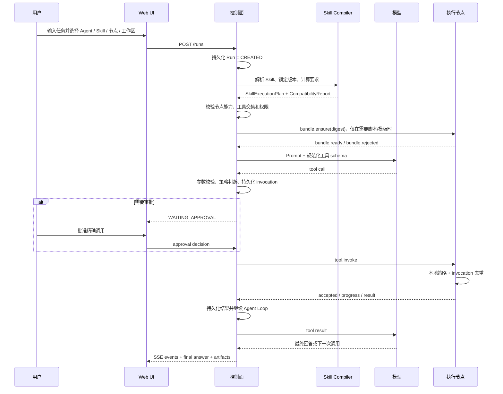

# Agent Studio 控制面、执行节点与 Skill Runtime 架构设计

- 状态：Proposed
- 日期：2026-07-31
- 适用范围：ChatGPT 类 Web 工作台、远程电脑/服务器节点、市面 `SKILL.md` 能力包

## 1. 结论

目标产品不是“网页聊天后，把除模型以外的所有逻辑都放到客户端”，而是三个平面：

1. **控制面（Agent Studio Backend）**：保存上下文、编排 Agent、编译 Skill、决策权限、路由工具、持久化状态与审计。
2. **推理面（Model Provider）**：执行模型推理。它可以是云端 OpenAI-compatible API，也可以是本地模型服务。
3. **执行面（Agent Studio Node）**：在被授权的电脑、服务器或沙箱中操作文件、命令、Git、浏览器、本地 MCP 和桌面。

一句话边界：

> 服务端决定做什么、允许做什么、在哪个节点做；节点只在本机边界内执行已经授权的动作；模型提供建议和工具调用，但不拥有最终权限。

保留 Spring Boot 模块化单体作为控制面，不在当前阶段拆微服务。节点继续作为独立 Java 进程，通过主动发起的 WSS 长连接接入。市面 Skill 先被服务端规范化和编译，纯指令留在服务端，资源按需读取，脚本与本地操作才下发节点执行。

## 2. 设计目标与非目标

### 2.1 目标

- 提供 ChatGPT 类的对话、模型、Agent、知识库、Skill、MCP 和任务界面。
- 让一次 Run 可以安全地操作用户指定的电脑或服务器。
- 尽可能兼容市面采用 `SKILL.md + references/scripts/assets` 目录结构的 Skill。
- 支持断线、审批、取消、超时、重连和审计，而不是把一次 HTTP/WebSocket 连接当作任务本身。
- 本地单用户模式保持易启动，同时保留演进为多租户控制面的边界。
- 让权限来自平台策略和用户授权，而不是来自模型、Skill 或节点自报。

### 2.2 非目标

- 当前阶段不让节点拥有独立的模型循环和长期记忆。
- 当前阶段不自动运行任意下载脚本，也不静默安装 Skill 依赖。
- 当前阶段不承诺所有平台专有 Skill 零修改运行。
- 当前阶段不实现跨多个物理节点共享同一个可变工作区。
- 当前阶段不以微服务、消息队列或 Kubernetes 作为本地运行前提。

## 3. 设计依据

### 3.1 仓库现状依据

| 已有事实 | 代码或决策依据 | 对目标架构的约束 |
|---|---|---|
| Run 先持久化，再异步执行 | `RunCommandService.create` 在事务提交后提交执行任务 | Web 请求不是任务生命周期；恢复必须围绕持久化 Run 设计 |
| 模型循环由服务端控制 | `CodingAgentLoop` 负责模型轮次、工具预算、审批暂停和恢复 | 节点不应再实现第二套 Agent Loop |
| 节点主动连接服务端 | ADR-0005、`NodeWebSocketClient` | 适合 NAT/内网设备；保持出站 WSS，不要求服务端主动连接用户电脑 |
| 节点只上报能力事实 | `NodeCapabilityPayload` 不包含风险、启用和审批字段 | 权限策略必须由服务端掌握，节点自报不能扩权 |
| 工具在服务端筛选后暴露给模型 | `CodingToolAdapter.availableTools` | 继续采用显式 Tool Catalog/allow-list，不把原始节点接口直接交给模型 |
| 服务端与节点都有路径边界 | `CodingWorkspaceScope`、节点 `FileTool/ShellTool` | 保留双重校验，不能只信任任一侧 |
| 高风险调用有持久化审批 | `NodeToolApprovalEntity`、`RunCommandService` continuation | 审批必须绑定具体参数并可恢复，不能只弹一次临时确认框 |
| Skill 当前只是可安装的数据 | `SkillCatalog` 保存 `SKILL.md` 和附属文件但不执行脚本 | 需要补充 Skill 解析、编译、资源访问、兼容检查和节点分发 |
| 当前 Run 只记录所选 `skillIds` | `RunCommandService.buildCapabilityContext` | “已安装”不等于“运行时生效”，必须注入 Skill 正文和版本快照 |
| 控制面由单人开发且需本地易启动 | ADR-0002 | 先完善模块边界和持久状态，不提前拆微服务 |

### 3.2 工程原则依据

| 原则 | 采用的设计 | 理由 |
|---|---|---|
| 控制面与执行面分离 | 后端编排，节点执行 | 云端后端无法直接访问用户本机；本地权限也不应集中到 Web 进程 |
| 零信任与最小权限 | 服务端策略与节点本地策略双重校验 | 网络位置、节点自报和模型输出都不能自动获得信任 |
| 模型是非确定性规划器 | 所有工具使用结构化 schema、allow-list 和参数校验 | Prompt 约束不能代替授权和代码校验 |
| 分布式调用不存在天然的 exactly-once | `invocationId` 去重、状态查询、未知状态，不盲目重试 | 断线时服务端无法仅凭超时判断节点是否已经产生副作用 |
| 不可信供应链输入 | Skill 按摘要锁定、安装时分析、脚本默认需授权 | GitHub 来源和 `SKILL.md` 内容不能自动成为可信代码 |
| 大对象与控制消息分离 | WebSocket 传控制/进度，HTTP/Object Store 传包和产物 | 避免长连接被截图、压缩包和日志阻塞，也便于断点和校验 |
| 状态可复现 | Run 固定模型、Agent、Skill、工具 schema 和节点能力快照 | Skill 更新或节点重连不能悄悄改变正在运行的任务 |

外部安全与协议参考见文末。它们提供原则和协议基础，不替代本项目自己的威胁建模。

### 3.3 当前实现与目标架构的差距

以下不是远期优化，而是当前代码进入远程部署前必须正视的边界：

| 当前实现 | 直接风险 | 目标要求 |
|---|---|---|
| HTTP API `permitAll`，tenant/user 来自可伪造请求头 | 任何能访问端口的人都可能创建节点令牌、发起调用或批准操作 | 本地开发只绑定 loopback；远程部署前接入可信认证，租户来自已验证 principal/claim |
| 长期 `nodeSecret` 位于 WebSocket query，客户端打印完整连接 URI | 密钥进入代理、终端和文件日志 | 使用 WSS Authorization/challenge 或 mTLS，凭据可轮换且日志永不输出 |
| 客户端打印完整 `tool.invoke` | 命令、文件内容和密钥可能进入日志 | 只记录 invocationId、工具名、状态和脱敏摘要 |
| workspace Shell 只约束 `cwd` | 子进程仍继承当前 OS 用户权限、环境变量和网络，可访问工作区外资源 | 明确标记它不是沙箱；脚本/Shell 使用低权限账户或 OS 沙箱、最小环境和默认禁网 |
| `browser.open` 接受任意 URL，截图可写调用方指定的绝对路径 | 可能访问 `file://`、环回/内网/云元数据，或覆盖任意路径 | URL/scheme/IP 策略；截图、下载和 trace 固定写入 Artifact 目录 |
| WebSocket 文本上限 256 KiB，`fs.read` 可返回约 1 MiB | 较大结果可能直接断开节点连接 | 小结果统一预算；大结果切片或转 Artifact |
| WebSocket session 和 pending Future 只在内存 | 服务端重启或断线后无法判断真实执行状态 | 持久 dispatch、节点 journal、ack/status/cancel 和状态对账 |
| 数据库 invocation ID 与传输 invocation ID 分别生成 | 无法稳定去重、恢复和端到端排障 | 一个稳定 invocationId 贯穿数据库、协议、节点 journal 和审计 |
| 直接节点调用与 MCP 调用未统一落审计 | 同一工具因入口不同而失去审计和审批 | 所有模型/REST/工作流入口统一经过 ToolRouter、Policy 和 Invocation Ledger |
| MCP `requiresApproval` 目前只是元数据 | 高风险 MCP 调用可能绕开实际审批 | MCP、Backend、Node Provider 使用同一策略与审批执行器 |
| Agent `toolAllowList` 和 Run `toolNames` 尚未约束实际模型工具集合 | 页面选择和 Agent 配置可能只是提示文字 | 在准备阶段计算有效工具交集，模型只收到最终集合 |
| 能力上报只 upsert，旧能力不会失效；可用性字段丢失 | 服务端可能继续展示节点已不支持的工具 | 版本化完整 snapshot，以本次快照替换旧事实，保留历史只用于审计 |
| Run 的完整请求只存在于进程内闭包 | 控制面重启后，数据库里的 `CREATED/RUNNING` 无法按原输入恢复 | 持久化不可变 `RunSpec`、执行 lease 和启动恢复扫描 |
| 当前 `TOKEN_DELTA` 是完整响应后再切片 | UI 看似流式，但不能降低首 token 延迟或中途取消上游模型 | 明确标注现状；后续由 ModelGateway 提供真实 streaming，不影响核心边界 |
| `tool` 与 `node` 已出现源码依赖循环 | 模块边界继续漂移后难以独立测试或拆分 | 编排依赖统一 Tool SPI；Node 作为 Provider 实现，不反向依赖编排实现 |

因此，当前实现应被定义为“受信任本机上的功能演示”，不能直接作为公网电脑控制服务上线。

## 4. 系统上下文



### 4.1 什么运行在哪里

| 能力 | Web UI | 控制面 | 模型供应商 | 执行节点 |
|---|---:|---:|---:|---:|
| 会话和 Run 状态 | 展示 | **拥有** | - | 缓存少量执行状态 |
| Prompt 与 Skill 指令组装 | - | **拥有** | 消费 | - |
| 模型推理 | - | 发起/治理 | **执行** | 可作为未来本地模型端点 |
| Agent 工具循环 | - | **拥有** | 选择工具 | 只执行单次调用 |
| RAG、联网搜索、中央 HTTP MCP | - | **执行** | - | - |
| 本地 STDIO MCP | - | 路由/授权 | - | **执行** |
| 文件、Shell、Git、浏览器 | - | 路由/授权/审计 | - | **执行** |
| Skill 脚本 | - | 分析/编译/授权 | - | **受限执行** |
| 审批 | 用户操作 | **持久化决策** | - | 校验授权后执行 |
| 大文件和产物 | 上传/下载 | 元数据与存储入口 | - | 产生/消费 |

## 5. 控制面内部架构

继续使用模块化单体，但把“模型可调用工具”统一到一个路由层。当前 `CodingToolAdapter` 只聚合节点编码工具，无法同时支持 Skill 资源、中央 MCP 和节点本地 MCP；目标是让 Agent Loop 只依赖统一的 `ToolRouter`。



源码依赖方向固定为：`orchestration -> tool API`，`node -> tool SPI`，`mcp -> tool SPI`。`tool` 模块不能反向 import `node` 或 `mcp` 的实现类型；Provider 通过依赖注入注册。这样可以消除当前 `tool <-> node` 循环，并让模块化校验真正发挥作用。

### 5.1 关键组件

| 组件 | 职责 | 不负责 |
|---|---|---|
| `RunCoordinator` | Run 状态机、准备、暂停、恢复、取消、终态 | 直接访问节点 WebSocket |
| `ContextAssembler` | 按优先级组装平台指令、Agent、Skill、证据和历史 | 授予工具权限 |
| `SkillAnalyzer` | 解析 frontmatter、目录、脚本、资源和依赖提示 | 执行脚本 |
| `SkillCompiler` | 生成本次 Run 的 Skill 指令、工具绑定和执行要求 | 修改第三方 Skill 原文件 |
| `SkillCompatibilityService` | 将 Skill 要求与节点/平台能力做预检 | 在运行中猜测缺失环境 |
| `ToolCatalog` | 提供规范化逻辑工具描述和 schema | 决定具体调用是否允许 |
| `ToolPolicyService` | 计算有效权限、风险和审批要求 | 相信 Skill 的 `allowed-tools` 能扩权 |
| `ToolRouter` | 根据 Run 内固定的 binding 路由到后端、MCP 或节点 | 让模型指定任意 provider/node |
| `NodeDirectory` | 节点、在线状态、能力快照、标签和版本 | 执行本地命令 |
| `NodeDispatchService` | 持久化 invocation、下发、进度、取消、结果归并 | 重新实现 Agent Loop |
| `ArtifactService` | Skill 包、截图、生成文件和日志附件的元数据/传输 | 把大二进制塞进 WebSocket JSON |

### 5.2 Prompt 优先级

```text
平台安全与权限规则
  > Agent system prompt
  > 已启用且锁定版本的 Skill 指令
  > RAG / Web / MCP / Tool 返回的非可信证据
  > 会话历史
  > 当前用户消息
```

这里的“优先级”只用于解释冲突。真正的权限仍由代码策略决定。Skill、网页、文档和工具输出都可能包含 Prompt Injection，不能通过文字要求改变工具 allow-list、审批规则或节点范围。

## 6. 执行节点内部架构



节点职责：

- 上报“事实能力”：操作系统、架构、客户端版本、工具 schema、运行时版本、协议特性和并发上限。
- 在本地再次检查工作区、绝对路径、命令、网络、超时和输出限制。
- 按 `invocationId` 去重，并保存最小执行日志，避免断线重发造成重复副作用。
- 缓存按摘要寻址的 Skill Bundle；执行前校验 SHA-256。
- 将模板复制到 Run 工作区，将原始 Bundle 保持只读。
- 通过受控进程管理器执行脚本，不把任意进程句柄暴露给模型。
- 对 Shell/脚本采用真正的 OS 级限制。只限制 `cwd` 不是沙箱，不能阻止命令读取工作区外文件、继承环境变量或联网。
- 上传产物，回传结构化结果，主动脱敏并限制输出大小。

节点不负责：

- 选择模型、维护完整会话、解释 Skill、决定风险等级或自动批准调用。
- 根据自身上报把工具设置成低风险或默认启用。
- 在没有明确授权时自动安装依赖、扩大目录范围或开放网络。

## 7. 一次 Run 的完整流程



### 7.1 Run 准备阶段必须固定的快照

- `modelProfileId` 与模型能力版本。
- Agent system prompt 摘要。
- 每个 Skill 的 `id/version/source/digest`。
- Skill 编译后的指令摘要与工具绑定。
- 节点 ID、能力 revision、工作区引用。
- 可用工具 schema 摘要和策略 revision。
- 对高风险操作生效的审批模式。

这样运行中即使 Skill 被升级、管理员修改工具或节点重连，Run 也能识别“配置已变化”，而不是静默切换语义。

## 8. Skill Runtime 设计

### 8.1 不要求市场 Skill 修改目录格式

入口仍采用常见目录约定：

```text
my-skill/
├── SKILL.md
├── references/
├── scripts/
├── templates/
└── assets/
```

安装后由平台生成内部描述，不要求第三方仓库预先包含平台专有 manifest：

```json
{
  "skillId": "my-skill",
  "declaredVersion": "1.2.0",
  "resolvedCommit": "40-character-git-commit",
  "digest": "sha256:...",
  "instruction": "SKILL.md",
  "resources": ["references/**", "templates/**", "assets/**"],
  "entrypoints": ["scripts/run.py"],
  "requirements": {
    "tools": ["fs.read", "fs.write"],
    "runtimes": [{"name": "python", "version": ">=3.11"}],
    "network": "none"
  },
  "trust": "unreviewed"
}
```

`SKILL.md` 没有声明的字段可以由分析器保守推断，但推断结果只能形成“要求和警告”，不能形成授权。

`declaredVersion` 只用于展示；不可变身份使用 `resolvedCommit + digest`。安装 `main`、tag 或其他可移动 ref 时必须先解析到 commit。升级产生新的 release，不能覆盖正在被 Run 引用的旧包。

### 8.2 Skill 生命周期

```text
DISCOVERED
  -> DOWNLOADED
  -> ANALYZED
  -> REVIEW_REQUIRED
  -> ENABLED
  -> VERSION_PINNED_FOR_RUN
  -> STAGED_ON_NODE（仅需要时）
  -> EXECUTED / FAILED
```

安装阶段至少检查：路径穿越、符号链接、文件数/大小、可执行脚本、二进制文件、依赖声明、外部 URL、疑似密钥和高风险命令。分析结果展示给用户，启用与安装分开。

### 8.3 四类兼容级别

| 等级 | Skill 类型 | 运行策略 | 预期兼容性 |
|---|---|---|---:|
| L1 直接兼容 | 只有 `SKILL.md` 的指令型 Skill | 服务端注入指令 | 高 |
| L2 资源兼容 | references/templates/assets | 服务端按需读取；需要产物时将模板复制到节点 | 高 |
| L3 运行时兼容 | Python/Node/Shell 脚本 | Bundle 下发节点，通过 `skill.script.run` 受限执行 | 中 |
| L4 适配兼容 | 依赖某厂商内置 Tool/API/桌面宿主 | Tool Alias 或专用 Provider 适配 | 低到中 |

仓库里已经安装的 `algorithmic-art` 就是典型依据：它要求先用名为 `Read` 的工具读取 `templates/viewer.html`，再写出 HTML，并允许页面加载 CDN 资源。只把它的 Markdown 注入模型仍然无法工作；还必须同时解决 `Read -> fs.read` 别名、模板的 `skill://` 寻址、输出工作区和网络策略。

运行前返回 `CompatibilityReport`：

```json
{
  "status": "COMPATIBLE_WITH_APPROVAL",
  "skillId": "my-skill",
  "nodeId": "node_123",
  "bindings": {"Read": "fs.read", "Write": "fs.write", "Bash": "shell.run"},
  "missingRequiredTools": [],
  "missingRuntimes": [],
  "warnings": ["Contains executable Python code", "Network access was not declared"],
  "requiredApprovals": ["fs.write", "skill.script.run"]
}
```

如果缺少必需能力，应在调用模型前失败，避免模型运行到一半才发现节点无法完成任务。

兼容检查通过后，服务端生成并随 Run 固定内部 `SkillExecutionPlan`：

```json
{
  "runId": "run_...",
  "releases": [{"skillId": "my-skill", "digest": "sha256:..."}],
  "instructionDigests": ["sha256:..."],
  "toolBindings": {"Read": "node:node_123:fs.read"},
  "executionTarget": {"nodeId": "node_123", "workspaceRef": "workspace-default"},
  "requiredBundles": ["sha256:..."],
  "requiredRuntimes": [{"name": "python", "range": ">=3.11"}],
  "networkPolicy": "none",
  "policyRevision": "policy_..."
}
```

它是服务端编译产物，不由模型或节点自行修改，也不包含 secret、服务端绝对路径或可直接扩权的字段。

### 8.4 工具名称适配

第三方 Skill 中的名称是逻辑要求，不直接等于平台权限：

| 常见 Skill 名称 | 平台逻辑工具 | 默认路由 |
|---|---|---|
| `Read` | `fs.read` | 选定节点 |
| `Write` | `fs.write` | 选定节点 |
| `Edit` / `ApplyPatch` | `fs.apply_patch` | 选定节点 |
| `Glob` / `Grep` | `fs.search` | 选定节点 |
| `Bash` / `Shell` | `shell.run` | 选定节点 |
| `Playwright` / `Browser` | `browser.*` | 选定节点 |
| `WebSearch` | `web.search` | 控制面 |
| `MCP:<server>/<tool>` | `mcp.<connection>.<tool>` | 中央或节点本地 Provider |

有效工具集合采用交集而不是并集：

```text
有效工具
  = Run 请求范围
  ∩ Agent allow-list
  ∩ Skill 编译后的约束（Skill 有明确声明时）
  ∩ 租户/用户策略
  ∩ 节点已启用能力
  ∩ 平台安全策略
```

Skill 写了 `allowed-tools: [Bash]` 只表示“它可能需要 Bash”，绝不表示平台必须启用 Shell。没有工具声明的市场 Skill 不会因此获得全部工具；它只能使用 Run、Agent、用户和平台原本允许的集合，分析器推断到的额外要求还需用户确认。

### 8.5 Skill 资源访问

- 文本 reference：由控制面的 `skill.resource.read(skillId, digest, path)` 按需读取，防止一次性把整个包塞入模型上下文。
- 模板/资产：通过 `skill://{skillId}@{digest}/{path}` 逻辑 URI 引用；需要修改时复制到 Run 工作区。
- 脚本：模型不能用服务端绝对路径执行；只能调用语义工具 `skill.script.run`，参数绑定 Bundle digest 和允许的 entrypoint。
- 大文件：走 Artifact API；WebSocket 只传 `artifactId/digest/size/contentType`。
- Bundle：内容寻址、不可变、校验摘要；同一节点命中缓存时不重复下载。

推荐的脚本执行接口：

```json
{
  "tool": "skill.script.run",
  "arguments": {
    "bundleDigest": "sha256:...",
    "entrypoint": "scripts/run.py",
    "argv": ["--input", "workspace/input.json"],
    "cwd": "workspace",
    "timeoutSeconds": 120,
    "networkPolicy": "none"
  }
}
```

不推荐直接把 Bundle 路径拼进任意 `shell.run`，因为这会绕过 entrypoint 白名单、摘要绑定和运行时审计。

## 9. 节点选择与会话粘性

### 9.1 默认策略

- 操作个人电脑时要求用户显式选择节点和工作区。
- 一个有状态的 Agent Loop 固定在同一节点，浏览器 session、进程句柄和本地文件不跨节点迁移。
- 只有受管理的服务器/沙箱池允许按标签自动选择，例如 `os=linux && python>=3.11`。
- 跨节点工作流只能在 Step 边界通过 Artifact 传递不可变产物，不共享隐含本地状态。

理由：自动选择个人设备容易在错误电脑上产生副作用；而浏览器、进程和未提交文件都依赖本地会话，运行中换节点无法保证语义一致。

### 9.2 能力模型

节点能力分成两类，不能混用：

1. **事实能力**：节点上报，例如工具 schema、OS、运行时版本、协议特性、最大并发。
2. **授权策略**：服务端配置，例如是否启用、风险等级、是否审批、路径和用户范围。

建议能力快照：

```json
{
  "revision": "cap_20260731_001",
  "clientVersion": "0.2.0",
  "os": {"name": "Windows", "arch": "amd64"},
  "features": ["tool-progress-v1", "skill-bundle-v1", "artifact-http-v1"],
  "runtimes": [{"name": "java", "version": "21"}, {"name": "node", "version": "22"}],
  "tools": [{"name": "fs.read", "version": "1", "inputSchema": {}}],
  "maxConcurrency": 4
}
```

## 10. 节点协议

### 10.1 传输

- 本地开发允许 `ws://localhost`，远程部署只允许 `wss://`。
- 节点主动连接服务端，以适应 NAT 和企业内网。
- WebSocket 是控制通道：认证、心跳、能力、调用、进度、取消和小结果。
- Bundle、截图、大日志和产物走带节点认证的 HTTP 下载/上传。
- 所有消息带协议版本、消息 ID、关联 ID 和时间戳。

推荐信封：

```json
{
  "protocolVersion": "1.1",
  "type": "tool.invoke",
  "messageId": "msg_...",
  "sessionId": "session_...",
  "sequence": 42,
  "correlationId": "nodeinv_...",
  "sentAt": "2026-07-31T12:00:00Z",
  "expiresAt": "2026-07-31T12:02:00Z",
  "traceId": "trace_...",
  "payload": {}
}
```

### 10.2 调用消息

```json
{
  "type": "tool.invoke",
  "invocationId": "nodeinv_...",
  "runId": "run_...",
  "toolCallId": "call_...",
  "toolName": "fs.write",
  "arguments": {"path": "src/App.java", "content": "..."},
  "workspaceRef": "workspace-default",
  "executionSessionId": "run_...",
  "deadlineAt": "2026-07-31T12:02:00Z",
  "policyRevision": "policy_...",
  "argumentsDigest": "sha256:...",
  "attempt": 1,
  "idempotencyKey": "nodeinv_..."
}
```

节点响应至少包含：

- `tool.accepted`：已经记录 invocation，尚未说明成功。
- `tool.progress`：有限频率的进度或日志摘要。
- `tool.result`：终态、结构化结果、错误码、产物引用和结果摘要。
- `tool.status.result`：重连后查询历史 invocation 状态。
- `tool.cancel.ack`：收到取消；不能把“已收到取消”等同于“副作用已回滚”。

### 10.3 调用一致性

调用状态建议扩展为：

```text
REQUESTED -> APPROVAL_REQUIRED -> DISPATCHED -> ACCEPTED -> RUNNING
  -> SUCCEEDED | FAILED | CANCELLED | TIMED_OUT | UNKNOWN
```

规则：

1. 服务端先持久化 invocation，再下发。
2. 节点先把 `invocationId` 写入本地 SQLite/journal，再执行有副作用操作。
3. 重复 `invocationId` 不重复执行；返回正在运行或已缓存结果。
4. 连接中断后，服务端先查询状态。对写文件、提交、Shell 和桌面操作不得自动重试。
5. 服务端超时但无法确认节点终态时记录 `UNKNOWN`，不能错误标成 `FAILED`。
6. 只对明确无副作用且声明为幂等的读工具做有限自动重试。
7. 服务端接收结果时校验 session、node、invocation、tool、attempt 和参数摘要，不能只按一个 ID 完成内存 Future。
8. 新连接获得递增 fencing token，旧连接迟到的心跳和结果不能覆盖新 session 状态。

交付语义定义为“至少一次传输 + 节点幂等去重”，不宣称 exactly-once。这是分布式系统的必要约束：超时只表示“没有及时收到结果”，不表示“对方没有执行”。

## 11. 安全架构

### 11.1 信任边界

以下输入一律不可信：

- 用户消息和上传文件。
- 模型输出和工具参数。
- 第三方 Skill 的指令、脚本、二进制和依赖。
- 网页、RAG 文档、MCP 和工具输出。
- 节点上报的描述、schema 和运行时事实。

### 11.2 必须满足的控制

| 风险 | 控制 |
|---|---|
| 恶意 Skill 诱导扩权 | Skill 声明不能授予权限；工具取多方策略交集 |
| Prompt Injection | 外部内容低优先级；权限决策不由 Prompt 实现 |
| 路径穿越/误操作 | 服务端规范化逻辑路径，节点按真实文件系统再次校验 |
| 任意命令执行 | Shell 默认高风险；脚本使用固定 digest/entrypoint；限制 cwd、超时、输出和网络 |
| 节点伪造低风险 | 风险、启用和审批完全由服务端策略目录决定 |
| 服务端密钥泄露给模型 | 模型只看到逻辑工具；节点 secret、会话和凭据永不进入 Prompt |
| 重放或重复副作用 | WSS、短期凭据、`invocationId` 去重、审批参数摘要和过期时间 |
| 敏感日志泄露 | 参数分类、结果截断、secret masker、二进制转 Artifact、审计展示分级 |
| 依赖供应链攻击 | Bundle digest、来源记录、安装分析、显式依赖批准、可选签名/来源证明 |
| 桌面隐私风险 | 桌面能力单独开关、可见 session、精确审批、截图保留策略 |
| 浏览器 SSRF/本地文件读取 | 默认只允许 `http/https`；阻止 `file/data/chrome`、环回、私网和云元数据地址；按任务显式放行 |
| cwd 被误当作沙箱 | Shell/脚本使用低权限身份和 OS 隔离；清理继承环境，文件挂载与网络默认最小化 |

### 11.3 双重授权

服务端做业务授权，节点做资源授权：

```text
服务端：租户 + 用户 + Run + Agent + Skill + 工具策略 + 审批
节点端：节点模式 + workspace + 本地路径 + 命令 + runtime + 网络 + 资源上限
```

任一侧拒绝，调用都不能执行。节点本地策略是最后一道防线，不应允许服务端参数绕过注册时选定的 `WORKSPACE`/`SYSTEM` 模式。

### 11.4 认证演进

当前 `nodeId + nodeSecret` 放在 WebSocket query 中适合第一版闭环，但生产版建议：

1. 注册令牌仍然一次性、短有效期。
2. 节点本机生成 EC/Ed25519 密钥对；私钥进入 Windows DPAPI/CNG、macOS Keychain 或 Linux Secret Service，不明文写普通 JSON。
3. 注册后绑定公钥并颁发可轮换的短期节点凭据，服务端仅保存摘要或公钥。
4. WebSocket 使用 `Authorization` header 或短期 challenge，不把长期 secret 放 URL。
5. 强制 WSS、校验服务端证书；企业版优先使用 mTLS。
6. 支持凭据吊销、轮换、设备丢失处理和节点重新注册。

## 12. 数据模型

### 12.1 保留现有实体

- `agent_run`、`run_event`、`conversation`、`message`。
- `node_connection`、`node_tool`、`node_tool_invocation`、`node_tool_approval`。
- 当前文件型 Skill Catalog 可继续作为本地模式的包存储。

### 12.2 建议新增的逻辑数据

| 数据 | 关键字段 | 用途 |
|---|---|---|
| `run_spec` | runId, input, model, agent, skills, tools, target, configDigest | 控制面重启后按原始请求恢复，不依赖内存闭包 |
| `skill_version` | skillId, version, digest, source, trust, analysis | 不可变版本和供应链记录 |
| `run_skill_binding` | runId, skillVersionId, instructionDigest, bindingsJson | 固定本次 Run 的 Skill 语义 |
| `node_capability_snapshot` | nodeId, revision, payload, reportedAt | 兼容检查和审计 |
| `run_execution_target` | runId, nodeId, workspaceRef, capabilityRevision | 节点粘性 |
| `capability_invocation` | id, providerType, target, argumentsDigest, policy, status | 统一审计 Backend/MCP/Node/手工入口，可与现有 node invocation 渐进合并 |
| `artifact` | id, runId, digest, size, mediaType, storageKey, retention | 统一产物传输 |
| `tool_policy_revision` | revision, scope, rules | 解释一次调用为何被允许/审批/拒绝 |

`node_tool_invocation` 建议补充：`dispatchAttempt`、`acceptedAt`、`deadlineAt`、`idempotencyKey`、`policyRevision`、`resultDigest` 和 `UNKNOWN` 终态。

本地版可以先用 H2 + 本地对象目录；企业版再替换为 PostgreSQL + S3/MinIO。业务接口不应依赖具体存储。

## 13. MCP 的放置规则

| MCP 类型 | 放置位置 | 理由 |
|---|---|---|
| 公网 Streamable HTTP MCP | 控制面 | 容易统一认证、限流和审计 |
| 控制面能访问的 STDIO MCP | 控制面 | 部署简单，适合中央能力 |
| 依赖用户本机文件/登录态的 STDIO MCP | 节点 | 控制面无法访问本机资源，也不应复制凭据 |
| 企业内网 MCP | 能访问该网络的服务器节点或控制面 | 按网络边界选择，而不是按协议名称选择 |

目标 `ToolRouter` 对模型隐藏位置差异。MCP 工具必须使用连接命名空间，避免两个 Server 的同名工具冲突。

## 14. 故障与恢复

| 故障 | 处理方式 |
|---|---|
| 模型限流 | 有界退避；Run 保持可观察；超过预算失败 |
| 节点离线但尚未调用工具 | Run 进入 `WAITING_NODE` 或明确失败，由用户选择是否等待 |
| 工具执行中断线 | invocation 进入 `UNKNOWN`，重连后查询，禁止盲目重放副作用 |
| 节点进程重启 | 从本地 journal 恢复已接受 invocation 状态；重新上报能力 revision |
| Skill Bundle 下载中断 | 按 digest 重试下载；校验失败删除临时文件，不污染不可变缓存 |
| 高风险调用待审批 | 持久化 continuation；批准/拒绝后恢复同一 Run 和同一工具调用 |
| 用户取消 | 停止模型循环，发送取消；清理本 Run 创建的受管进程/浏览器 session |
| 工具输出过大 | 截断模型可见摘要，完整内容作为受权限控制的 Artifact |
| 控制面重启 | 从 Run/continuation/invocation 恢复，而不是依赖内存 Future；这是后续必须补齐的恢复能力 |

## 15. 部署形态

### 15.1 本地个人版

```text
一台电脑：Web + Spring Boot + H2 + 本地对象目录
同一台电脑：独立 Node 进程
模型：云端 API 或本地 HTTP 模型服务
```

即使同机也保留独立节点进程，因为权限边界、升级节奏和将来远程接入都不同。用户可以只启动一条组合命令，但不应把两个运行时重新耦合进一个 JVM。

### 15.2 远程个人版

```text
云端/家庭服务器：控制面
用户电脑：Node 主动 WSS 连接
Skill/Run 元数据：控制面
本地项目和浏览器登录态：留在 Node
```

### 15.3 企业版（后续）

```text
无状态 API/Run Worker + PostgreSQL + Object Store
独立 Node Gateway（规模需要时再拆）
个人电脑节点 + 服务器池 + 云端沙箱池
OIDC / tenant policy / centralized audit
```

只有当连接数、Run Worker 扩缩容或部署团队边界真正需要时，才把 Node Gateway 或 Worker 从模块化单体拆出。当前先通过公开接口和持久状态保持可拆性。

## 16. 分阶段实现

### G0：任何远程开放前的安全闸门

- 默认只监听 loopback；非本机访问必须有真实认证和受验证的 ActorContext。
- 移除 URL/日志中的长期节点 secret 和完整 `tool.invoke`，启用 WSS 与凭据轮换。
- 修复浏览器 scheme/IP/下载/截图路径策略；统一 WebSocket 与工具结果大小预算。
- 在 UI 和文档中明确 workspace Shell 不是沙箱；远程高风险执行启用低权限账户或 OS 级隔离。
- 所有节点和 MCP 调用统一落审计；审批增加角色、有效期和精确参数绑定。

验收：未认证请求无法注册节点、调用工具或审批；日志检索不到凭据和明文工具参数；浏览器不能访问本地文件、云元数据或向 Artifact 目录外写文件；远程部署检查未通过时应用拒绝启动或明确标记不安全模式。

### P0：修正 Skill “选择但未生效”

- 使用完整 YAML parser 解析 frontmatter，把来源 ref 固定到 commit，并生成不可变 Skill Release/digest。
- `RunCommandService` 注入所选且启用的完整 `SKILL.md`。
- 校验 Skill 存在、启用、大小和顺序；Run 保存 release/digest，不覆盖被旧 Run 引用的版本。
- Prompt 测试证明 Skill 指令实际进入模型上下文。
- 此阶段只承诺 L1 指令型 Skill，不执行 scripts。

验收：选择一个纯指令 Skill 后，模型行为可观察地受其约束；禁用/不存在的 Skill 在模型调用前失败。

### P1：统一工具路由与兼容预检

- 引入 `ToolDescriptor/ToolProvider/ToolRouter`，接入后端工具、节点工具和 MCP。
- 实现 `SkillAnalyzer`、工具 alias 和 `CompatibilityReport`。
- 节点上报 runtime、feature、tool version 和 capability revision。
- 持久化完整 `RunSpec`、有效工具集合、节点目标和配置摘要；恢复不再依赖创建请求的内存闭包。
- 强制执行 Agent allow-list、Run 工具范围和 MCP 审批，不再只把这些配置写进提示词或元数据。
- 个人电脑节点仍由用户显式选择。

验收：缺少工具/运行时在 Run 准备阶段给出明确报告；两个 Provider 的同名工具不会冲突。

### P2：Skill Bundle、资源和脚本

- Bundle 按 digest 存储、下载、节点缓存和校验。
- 增加 `skill.resource.read`、`skill.script.run`、Run workspace materialization。
- 增加依赖/网络/超时/输出策略和脚本审批。
- 增加 Artifact API，不通过 WebSocket 传大对象。

验收：L2/L3 Skill 可在满足运行时要求的节点执行；Bundle 被篡改时执行失败；原 Bundle 不可写。

### P3：可靠协议

- 消息 envelope/version、accepted/progress/status/cancel。
- 数据库 invocationId 直接作为传输 ID；节点使用本地 journal 去重。
- Run Worker 使用持久队列/transactional outbox、执行 lease 和启动恢复扫描，不依赖单机内存 Future 维持任务事实。
- 服务端增加 `DISPATCHED/ACCEPTED/UNKNOWN`，重启恢复和状态对账。
- 节点凭据轮换，WebSocket secret 移出 query。

验收：在写文件调用执行中切断网络，不会自动重复写；重连后可确定或明确标记未知状态。

本地模式可用 H2 任务表加定时 worker 实现，不要求引入外部消息队列。

### P4：OpenClaw 类桌面能力与节点池

- 浏览器以外的桌面 session、截图/可访问性树、输入动作和可见运行指示。
- 桌面能力单独授权和保留策略。
- 服务器/沙箱节点按标签调度，个人设备继续显式选择。
- 跨节点只通过 Artifact 在工作流 Step 间传递。

验收：桌面动作可审计、可立即停止、不会因选择错误节点静默执行；节点池任务满足能力约束。

## 17. 不采用的方案

### 17.1 后端直接操作所有机器

不能访问 NAT 后的用户电脑，权限集中，云端部署后无法使用本地文件和登录态。拒绝。

### 17.2 把 Agent Loop、Prompt 和 Skill 全部下放节点

会产生多份上下文、策略和审计实现，模型密钥也扩散到每台节点，难以统一恢复和升级。节点只做执行更合适。拒绝作为默认架构。

### 17.3 所有 Skill 文件都直接塞进 Prompt

浪费上下文，二进制无法处理，且增加 Prompt Injection 面积。采用指令注入、文本按需读取、脚本/资产按摘要下发。

### 17.4 所有脚本都转成平台原生工具

安全性好但适配成本过高，会失去市场 Skill 兼容性。只把高频、敏感操作做成语义工具，其余脚本走受限 Skill Runtime。

### 17.5 工具超时就自动重试

写文件、Git、Shell 和桌面动作可能已经成功，自动重试会重复副作用。采用 idempotency、状态查询和 `UNKNOWN`。

### 17.6 立即拆成微服务

当前规模和开发团队不足以抵消部署、事务、调试和协议成本。保留模块化单体，通过模块边界和持久状态为未来拆分做准备。

## 18. 架构验收总表

- [ ] 模型永远拿不到节点 secret、WebSocket session 或存储真实路径。
- [ ] 未选择节点的 Run 不能调用任何本地工具。
- [ ] Skill 要求不能扩大 Agent/用户/节点已有权限。
- [ ] Run 能说明使用了哪个 Skill 版本、哪个节点能力快照和哪版策略。
- [ ] 服务端与节点对路径和高风险参数各校验一次。
- [ ] 有副作用调用在断线后不会自动重复执行。
- [ ] 纯指令 Skill 不需要分发节点即可生效。
- [ ] 脚本 Skill 只在满足 runtime 要求的节点、固定 Bundle digest 和受限工作区内执行。
- [ ] 大文件、截图和 Bundle 不通过 WebSocket 内嵌传输。
- [ ] 审批绑定 node、tool、规范化参数摘要、Skill digest、工作区、Run、调用 ID 和有效期，决定只能提交一次。
- [ ] 高权限场景支持二次认证，并可要求请求人与批准人分离。
- [ ] 控制面重启后能识别等待审批、运行中和未知状态的任务。
- [ ] 本地模式不依赖 Docker、消息队列或外部对象存储。

## 19. 参考

- 项目 ADR-0002：首版采用 Spring Modulith 模块化单体。
- 项目 ADR-0005：采用“后端控制中心 + 节点执行器”。
- RFC 6455, The WebSocket Protocol: <https://datatracker.ietf.org/doc/html/rfc6455>
- JSON-RPC 2.0 Specification: <https://www.jsonrpc.org/specification>
- NIST SP 800-207, Zero Trust Architecture: <https://csrc.nist.gov/pubs/sp/800/207/final>
- OWASP GenAI Security Project: <https://genai.owasp.org/>
- Model Context Protocol Specification: <https://modelcontextprotocol.io/specification>
- SLSA Supply-chain Levels for Software Artifacts: <https://slsa.dev/spec/>
