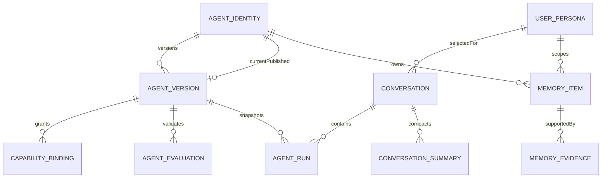

# Agent V2：角色、记忆与产品架构

状态：设计基线；Agent V2、草稿沙箱与长期记忆基础后端已实现

日期：2026-08-07

适用范围：Spring Agent Studio 后端、Web 前端、运行时、节点与后续多 Agent 编排

## 1. 结论

Agent V2 不再把“智能体”建模成名称加一段 `systemPrompt`，而是建模成一个可版本化的数字员工契约：

```text
Agent = Identity + Persona + Capabilities + Memory Policy
      + Runtime Policy + Safety Policy + Presentation
```

核心决策：

1. **定义与运行分离**：Agent 是可复用定义，Run 固定引用一个已发布版本。
2. **角色与能力分离**：角色决定“是谁、如何表达”，能力决定“能做什么”。
3. **记忆与知识分离**：记忆记录用户和交互中形成的信息，知识库提供有来源的外部事实。
4. **草稿与发布分离**：草稿可持续编辑；已发布版本不可变，保证历史 Run 可复现。
5. **简单界面、结构化底层**：普通用户只看到通俗字段和安全预设，高级配置按需展开。
6. **单 Agent 优先、多 Agent 可扩展**：首版不强迫用户画流程图，但契约支持委派、交接和子 Agent。

机器可读契约见 [agent-manifest-v2.schema.json](contracts/agent-manifest-v2.schema.json)。

## 2. 外部产品调研

本设计提炼能力模型，不复制任何单一产品的界面。

| 产品/框架 | 已验证的关键能力 | 对本项目的启示 |
| --- | --- | --- |
| [OpenAI Agents](https://developers.openai.com/api/docs/guides/agents) | Agent 定义、工具、状态、编排/交接、护栏、人工审批、追踪、评测、可恢复运行 | Agent 必须是运行契约，审批和可观测性不是附加功能 |
| [LangGraph Memory](https://docs.langchain.com/oss/python/langgraph/add-memory) | 线程级短期记忆、跨会话长期记忆、语义检索、裁剪、摘要、检查点 | 短期上下文和长期记忆必须分开存储、分开治理 |
| [Character.AI Definition](https://book.character.ai/character-guide/character-attributes/definition) | 名称、头像、问候语、开场建议、长短描述、示例对话、自由定义 | 人设不能只有提示词；问候、示例和开场问题直接影响可用性 |
| [Character.AI User Personas](https://book.character.ai/character-guide/user-personas) | 多用户画像、每个会话选择画像、默认画像 | Agent 角色和用户画像是两个独立对象，不能混写进同一提示词 |
| [n8n AI Agents](https://n8n.io/ai-agents/) | 模型、记忆、工具、可视化逻辑、模板、多 Agent、人工介入、日志与评测 | 生产 Agent 需要确定性步骤、错误分支和成本控制 |

由此得到热门 Agent 的八项共性能力：

1. 清晰角色与任务边界。
2. 多轮上下文和可控长期记忆。
3. 工具、知识库、MCP、Skill 等可插拔能力。
4. 计划、循环、委派与暂停恢复。
5. 高风险动作审批和输入/输出护栏。
6. 运行过程、引用、成本和失败原因可观察。
7. 模板、复制、版本、测试与发布。
8. 对话入口简单，高级配置渐进披露。

## 3. 当前实现与目标差距

当前 `agent_definition` 已能支撑单 Agent Chat，但不适合作为长期产品模型：

| 当前状态 | 风险 | V2 处理 |
| --- | --- | --- |
| `systemPrompt` 承载角色、行为和安全边界 | 难编辑、难测试、难局部复用 | 使用结构化 Manifest，发布时编译为运行提示词 |
| `toolAllowList` 是分隔字符串 | 缺少来源、风险、审批和版本语义 | 使用强类型 capability binding |
| 定义可直接原地修改 | 历史 Run 难以解释和复现 | 已发布版本不可变，Run 固定 `agentVersionId` 和 digest |
| 没有 `tenantId`、所有者和可见性 | 团队环境存在越权风险 | Identity 层加入租户、所有者、可见性和审计字段 |
| 没有独立记忆策略 | 容易把聊天历史误当永久记忆 | 引入短期、长期、用户画像三层模型 |
| 新 Agent 复制默认工具白名单 | 新角色可能获得不必要权限 | 新建默认无写权限，显式选择能力和审批预设 |

兼容原则：V2 首先包裹现有模型，不立即删除 `systemPrompt`、`toolAllowList` 或 `RunSpec v1`。

## 4. 领域模型



### 4.1 Agent Identity

稳定身份，只保存列表和权限判断需要的数据：

- `id`、`tenantId`、`slug`。
- `displayName`、`description`、`avatarRef`、`category`、`tags`。
- `ownerUserId`、`visibility`：`PRIVATE | TEAM | TENANT`。
- `status`：`ACTIVE | DISABLED | ARCHIVED`。
- `currentPublishedVersionId`。
- `createdAt`、`updatedAt`、审计人。

### 4.2 Agent Version

一个不可变的运行版本：

- `id`、`agentId`、`versionNumber`、`schemaVersion`。
- `state`：`DRAFT | VALIDATED | PUBLISHED | RETIRED`。
- `manifestJson`：通过 JSON Schema 校验的完整定义。
- `manifestDigest`：规范化 JSON 的 SHA-256。
- `compiledSystemPrompt`、`compiledPromptDigest`。
- `changeNote`、创建人、创建时间、发布时间。

已发布版本不得更新。编辑操作从最新版本复制新草稿，发布通过原子指针切换完成。

### 4.3 Capability Binding

能力绑定从 Manifest 投影成不可变行，用于引用校验、权限求交和查询：

- `kind`：`TOOL | SKILL | MCP | KNOWLEDGE | AGENT`。
- `targetId`、`targetRevision`、`required`。
- `riskLevel`、`approvalMode`、`configurationJson`。

运行时实际权限始终取以下交集：

```text
Actor permissions
  AND Agent version bindings
  AND Run temporary selection
  AND Node/MCP live capability
  AND organization policy
```

## 5. 角色设计

角色设计采用“结构化字段 + 高级自由指令”，避免把所有内容塞进一个输入框。

### 5.1 必填字段

- **职责名称**：用户一眼能懂，例如“代码审查员”。
- **使命**：一到两句话说明最终目标。
- **核心职责**：最多 8 条，使用动词开头。
- **服务对象**：面向谁、默认按什么知识水平沟通。
- **边界**：明确不做什么、何时必须询问或升级。

### 5.2 可选人格字段

- 性格特征：沉稳、严谨、耐心等可组合标签。
- 语言与语气：默认语言、回答密度、正式程度。
- 问候语和 1 至 6 个开场建议。
- 示例对话：用于展示沟通方式，不用于伪造事实。
- 高级指令：只补充结构化字段无法表达的规则。

### 5.3 Prompt 编译顺序

编译器使用固定顺序，避免字段间互相覆盖：

```text
平台安全规则
-> 组织策略
-> 角色身份与使命
-> 职责、边界、升级条件
-> 能力与工具使用规则
-> 记忆读写规则
-> 输出风格与示例
-> 本次 Run 上下文
```

自由指令不得覆盖平台安全规则、审批策略或工具权限。编译产物必须保存摘要，不在每次 Run 临时拼出不可追踪的新版本。

## 6. 记忆架构

### 6.1 三层记忆

| 层级 | 内容 | 生命周期 | 存储 |
| --- | --- | --- | --- |
| 工作记忆 | 当前 Run 的计划、工具结果、临时变量 | Run 结束 | RunSpec、checkpoint、event |
| 会话记忆 | 消息、会话摘要、最近任务状态 | 一个 conversation | 现有 message + `conversation_summary` |
| 长期记忆 | 稳定偏好、事实、事件、工作习惯 | 跨会话，可过期 | `memory_item` + 检索索引 |

知识库不属于长期记忆。知识库内容由文档拥有，必须保留引用；长期记忆由交互形成，必须保留来源和置信度。

用户画像与 Agent 人设是独立对象。会话可选择一个用户画像，Run 在创建时固定画像 JSON；画像只用于语言、解释深度、语气和稳定偏好，
不能授权工具或覆盖当前请求。画像记忆仅在选中该画像时召回，同时保留没有画像作用域的全局用户记忆。

### 6.2 长期记忆类型

- `PROFILE`：称呼、语言、稳定偏好。
- `SEMANTIC`：与用户或工作空间有关的事实。
- `EPISODIC`：过去任务、决策和结果。
- `PROCEDURAL`：用户偏好的工作方式和流程。

每条 `memory_item` 至少保存：

- 租户、Agent、用户画像和可选工作空间作用域。
- 类型、规范化内容、检索文本。
- 来源 conversation/run/message、证据摘要。
- `confidence`、`importance`、`sensitivity`。
- `createdAt`、`lastUsedAt`、`expiresAt`、`status`。

### 6.3 记忆写入

默认策略为 `SUGGEST`，而不是完全自动记住：

1. Run 结束后提取候选记忆。
2. 去重并与现有记忆检测矛盾。
3. 敏感信息直接拒绝或要求显式确认。
4. 依据策略自动保存、向用户建议或丢弃。
5. 保存来源、置信度和过期时间。

当前实现使用确定性规则识别用户明确的“记住……”和稳定偏好表达，不调用模型自由生成记忆。候选会按
tenant、user、Agent 和正文去重，并始终以 `CANDIDATE` 保存；即使策略配置为 `AUTO`，在行为评测完成前也不会绕过用户确认。
只有 `CONFIRMED`、未过期且属于当前 tenant + user + Agent 的记忆可以进入运行前召回。

禁止默认保存密码、密钥、支付信息、身份证明、完整医疗信息和原始工具返回。用户必须能查看、更正、删除、关闭和清空记忆。

### 6.4 记忆检索

```text
query rewrite
-> scope filter
-> semantic + keyword retrieval
-> recency/importance/confidence rerank
-> sensitivity check
-> bounded injection
```

检索结果默认最多 5 条，并标注为“可能相关的历史信息”，不能作为不可质疑的系统规则。发现矛盾时优先询问用户，不静默覆盖。

召回发生在 Run 创建阶段，命中的记忆正文和评分会保存为不可变 `memorySnapshots`。worker 不重新读取当前记忆表，
因此用户随后纠正或删除记忆不会改变已经排队或暂停恢复的 Run。

## 7. 运行、护栏与多 Agent

### 7.1 自主级别

用户选择通俗预设，底层映射为明确策略：

| 预设 | 行为 |
| --- | --- |
| 协助 | 只分析和建议；任何写操作前确认 |
| 执行 | 可执行低风险动作；中高风险动作审批 |
| 编排 | 可规划、调用子 Agent 和恢复任务；仍受风险审批约束 |

不得提供“无限权限”预设。

### 7.2 多 Agent

首版只暴露两个概念：

- **请专家协助**：当前 Agent 保持用户对话所有权，子 Agent 作为工具返回结果。
- **转交任务**：目标 Agent 接管后续步骤，Run 记录 handoff。

复杂 DAG 继续属于 Workflow，不塞进基础角色编辑器。Agent Manifest 只保存允许委派的目标和条件。

当前实现状态：

- `AS_TOOL` 已可执行。主 Agent 通过结构化工具调用决定是否咨询绑定专家，专家只接收聚焦任务，
  不继承主 Agent 的工具、知识库、MCP、记忆或审批上下文；结果返回主 Agent 核对和汇总。
- 协作者必须对发布者可见、处于启用状态并已有发布版本。草稿验证、发布和 Run 创建都会检查这些条件。
- 每个 Run 最多执行 4 次专家咨询，且不递归调用协作者，避免循环委派和失控的模型调用成本。
- `HANDOFF` 已可执行。一个 Agent 最多绑定一个 HANDOFF 专家，且不能与 `AS_TOOL` 混用。运行时跳过主 Agent
  路由和结果汇总，由目标专家使用已发布版本快照直接完成当前 Run；开始、模型调用和完成事件进入统一审计时间线。
  当前语义是“当前任务执行权转交”，不会永久修改 Conversation 绑定的 Agent，后续 Run 仍按会话当前配置创建。

### 7.3 运行快照

`RunSpec v3` 在现有字段上增加：

- `agentVersionId`、`agentManifestDigest`。
- `compiledPromptDigest`。
- `memoryPolicySnapshot`、不可变 `memorySnapshots`（记忆 ID、类型、正文和评分）。
- `userPersonaId`、不可变 `userPersonaSnapshotJson`。
- `capabilityBindingRevision`。
- `runtimePolicySnapshot`、`safetyPolicySnapshot`。
- `collaboratorBindings`，包含目标 Agent 的版本、Manifest digest、编译提示词、模型、模式和触发条件快照。

Run 永不读取“当前最新 Agent”继续执行；恢复时仍使用创建时快照。

## 8. UI 信息架构

设计继续遵守 [frontend-ui-spec.md](frontend-ui-spec.md) 的对话优先和渐进披露原则。

### 8.1 日常对话

日常工作台只增加必要信号：

```text
顶部：会话标题 | [头像] 代码审查员 v3 ▾ | 管理 | 更多

消息流
  Agent 回答
  已完成 4 个步骤 · 12 秒        [展开]
  使用了 2 条记忆                  [查看]

输入区
  [附件] [临时能力] 输入任务...                  [发送]
```

模型、Prompt、记忆参数、工具 JSON 不常驻显示。

### 8.2 Agent 管理

从统一“管理”弹窗进入“数字员工”，列表采用紧凑行而不是大卡片：

```text
数字员工                                      [新建]
搜索...                  状态 ▾   分类 ▾

[头像] 通用助理       日常问答与任务执行       已发布 v4   ···
[头像] 代码审查员     审查变更与风险           草稿       ···
```

编辑器在桌面端使用 `880px` 弹窗，移动端全屏：

```text
基本信息        名称、职责、简介、头像
角色行为        使命、职责、边界、语气、问候、示例
能力            模型、知识库、Skill、MCP、工具、协作 Agent
记忆与安全      记忆预设、自主级别、审批和数据范围
测试与发布      草稿预览、差异、检查结果、发布
```

普通模式每一项使用通俗表单控件；原始 Manifest、Prompt 预览、预算和检索阈值放入“高级设置”。右侧测试对话默认不写长期记忆、不执行高风险工具。

### 8.3 关键交互规则

- 新建 Agent 从角色模板或空白开始，不复制默认 Agent 的全部工具权限。
- 自动保存草稿，发布必须显式点击“发布”。
- 离开编辑器不丢草稿，也不影响线上版本。
- 发布前展示“会影响哪些新会话”，旧 Run 不受影响。
- 删除先归档；存在历史 Run 的 Agent 不做物理删除。
- 记忆开关使用分段控制：`关闭 | 仅当前会话 | 个性化记忆`。
- 每个长期记忆入口都提供“查看已记住内容”。

## 9. API 契约

### 9.1 当前已实现

```text
GET    /api/v2/agents
POST   /api/v2/agents
GET    /api/v2/agents/{agentId}
PATCH  /api/v2/agents/{agentId}
POST   /api/v2/agents/{agentId}/drafts
GET    /api/v2/agents/{agentId}/versions
GET    /api/v2/agents/{agentId}/versions/{versionId}
PUT    /api/v2/agents/{agentId}/drafts/{versionId}/manifest
POST   /api/v2/agents/{agentId}/drafts/{versionId}/validate
POST   /api/v2/agents/{agentId}/drafts/{versionId}/test-runs
POST   /api/v2/agents/{agentId}/drafts/{versionId}/evaluations
POST   /api/v2/agents/{agentId}/drafts/{versionId}/publish
POST   /api/v2/agents/{agentId}/archive

GET    /api/v2/memories?agentId=&personaId=&type=&status=&query=&limit=
POST   /api/v2/memories
PATCH  /api/v2/memories/{memoryId}
POST   /api/v2/memories/{memoryId}/confirm
POST   /api/v2/memories/{memoryId}/reject
DELETE /api/v2/memories/{memoryId}
POST   /api/v2/memories/clear

GET    /api/v2/personas
POST   /api/v2/personas
GET    /api/v2/personas/{personaId}
PATCH  /api/v2/personas/{personaId}
POST   /api/v2/personas/{personaId}/default
DELETE /api/v2/personas/{personaId}

PATCH  /api/v1/conversations/{conversationId}/persona
```

草稿版本响应包含 `revision`。更新 Manifest 时可提交 `expectedRevision`；修订号过期返回
`409 AGENT_REVISION_CONFLICT`，前端必须刷新并让用户决定是否合并。发布接口是幂等的：对当前已发布版本重复发布返回同一版本。

Agent 设置更新支持 `visibility: PRIVATE | TEAM | TENANT` 与 `status: ACTIVE | DISABLED`，并要求提交 Identity 的
`expectedRevision`。冲突返回 `409 AGENT_IDENTITY_REVISION_CONFLICT`。停用的 Agent 仍显示在管理列表中，但不能创建新 Run；
归档的 Agent 从默认列表隐藏，且通过独立归档接口处理。

草稿测试使用无状态消息列表，最多携带 20 条 `USER | ASSISTANT` 预览消息，最后一条必须是 `USER`。测试沙箱不创建
Conversation、Message、Run、Checkpoint 或记忆记录，不读取知识库和用户画像，也不向模型暴露任何工具定义。模型若返回工具调用，
响应以 `toolCallsBlocked: true` 和 notice 明确标记，但不会执行。

### 9.2 后续接口

```text
GET    /api/v2/memories?semanticQuery=&scope=
```

当前治理接口已支持 `agentId`、`personaId`、类型、状态和文本关键词筛选，以及候选确认、拒绝、修正、删除和清空。
运行时召回支持画像作用域和 `KEYWORD | SEMANTIC | HYBRID` 策略；未配置 Embedding 时自动退回关键词。
后续为治理列表增加显式语义查询和更通用的作用域表达，并为大规模数据引入独立向量存储。
后续更新接口沿用 ETag 或 `expectedRevision` 做乐观锁。发布接口返回最终版本摘要；行为测试通过后再将评测报告纳入发布响应。

## 10. 校验与评测

### 10.1 发布前静态校验

- Manifest 符合 schema，引用对象存在且可用。
- Agent 绑定的权限不超过发布者权限。
- 必填角色字段完整，无循环 handoff。
- Prompt 编译成功且未超过预算。
- 记忆作用域和敏感信息策略完整。
- 至少一个模型满足所需能力。

### 10.2 行为评测

每个发布版本可绑定最小评测集：

- 角色一致性和边界遵守。
- 工具选择正确率与无权限工具拒绝。
- 知识引用完整性。
- 记忆召回准确率、错误记忆率和敏感信息拒绝率。
- 审批触发率、任务成功率、成本和延迟。

评测结果属于版本，不能只挂在 Agent Identity 上。

当前评测结果按 `tenantId + versionId + manifestDigest + suiteId` 保存。发布事务不调用模型，只检查已经完成的最新报告；
草稿正文发生任何变化都会改变 digest，使旧报告自动失效。内置 smoke suite 使用无工具草稿沙箱，检查响应可用性、工具调用越界和内部标记泄露。
当 `requiredBeforePublish=true` 时，所有配置 suite 都必须有当前 digest 的报告，且平均分达到 `minimumPassRate`。

## 11. 渐进迁移计划

### Phase 0：契约与 UI 原型

- 固化 Manifest Schema、页面字段和 API 合同。
- 用现有 `agent_definition` 数据生成只读 V2 适配视图。
- 不改变当前 Run 路径。

### Phase 1：版本化 Agent

- 新增 identity/version/binding 表和发布流程。
- 将现有 Agent 迁移为 v1 已发布版本。
- `RunSpec v2` 固定 Agent 版本和 digest。
- 旧 `/api/v1/agents` 保持兼容，只映射当前发布版本。

### Phase 2：会话摘要与用户画像

- 引入 `user_persona` 和 `conversation_summary`。
- 先实现显式画像和短期摘要，不自动写长期记忆。

### Phase 3：长期记忆

- 上线候选提取、确认、检索、冲突和删除流程。
- 默认 `SUGGEST`，通过评测后再允许部分类型自动保存。

### Phase 4：协作 Agent 与模板市场

- 已上线可编辑角色蓝图、agent-as-tool 和单目标 handoff。
- handoff 已具备发布校验、不可变运行快照、直接执行和审计事件；永久会话归属迁移仍不属于当前语义。
- 模板市场仍属于后续阶段；当前蓝图是本地内置、应用后完全可编辑的安全起点。
- 复杂流程继续使用独立 Workflow 编辑器。

## 12. 首版验收标准

1. 用户能在 3 分钟内创建一个有名称、职责、边界、问候和能力的 Agent。
2. 普通模式无需编辑 JSON 或理解 Prompt 工程术语。
3. 草稿修改不影响已发布版本和正在运行的任务。
4. 每个 Run 可定位到唯一 Agent 版本、Manifest digest 和能力快照。
5. Agent 无法调用未绑定或 Actor 无权使用的能力。
6. 用户可以关闭记忆，并查看、纠正和删除所有长期记忆。
7. 长期记忆不会默认保存敏感信息或整段原始对话。
8. 发布前能运行静态校验和最小行为测试。
9. 日常对话页仍保持单栏、对话优先，不暴露管理复杂度。
10. 当前 V1 Agent 和历史 Run 在迁移期间继续可用。
