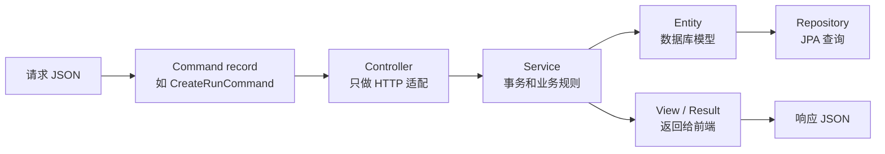
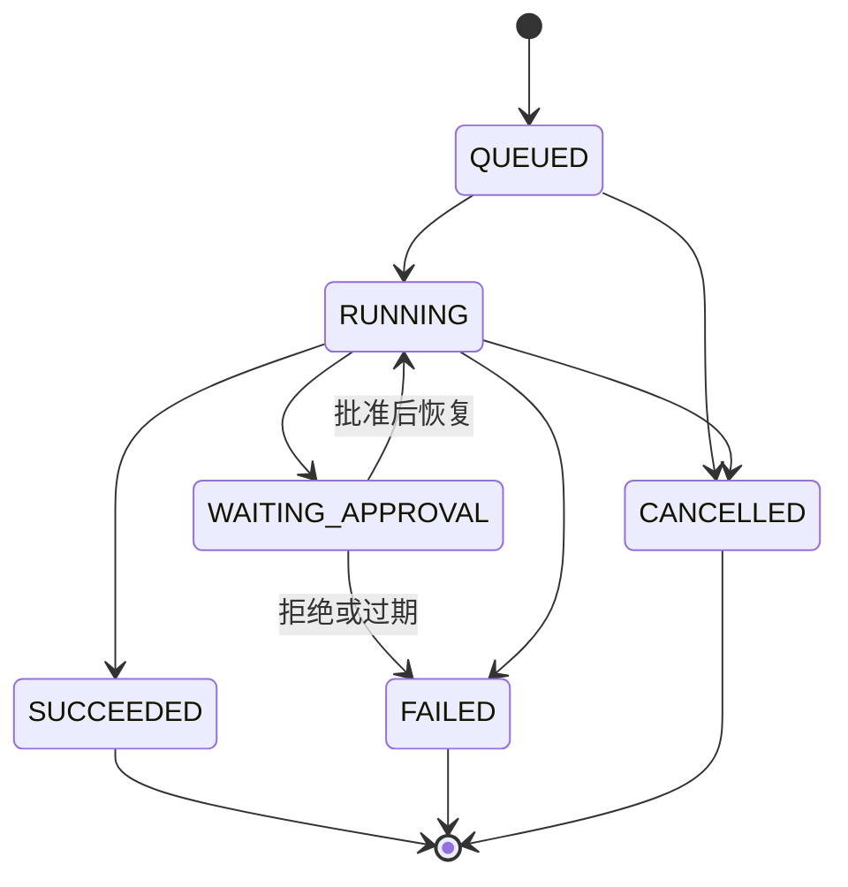
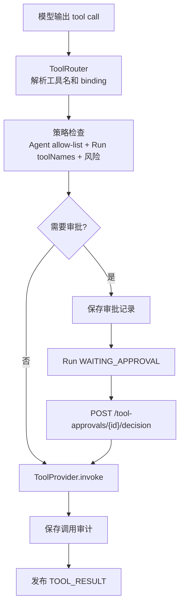
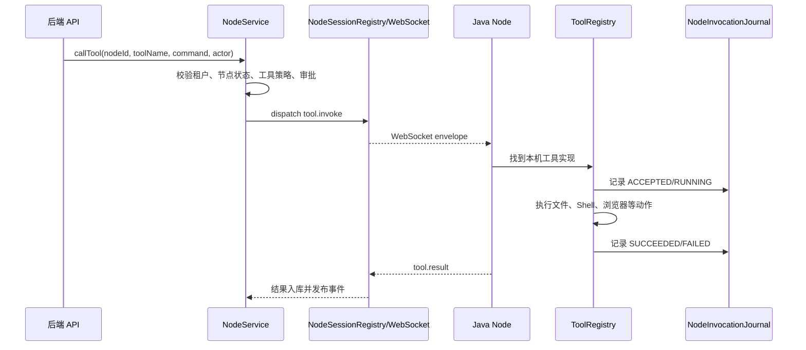
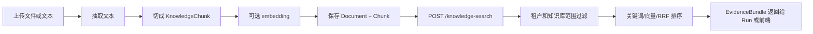

# API 与调用链学习指南

这份文档帮助 Java 新手把“HTTP 接口”和“后端代码链路”对应起来。

推荐学习方式：

1. 先启动后端；
2. 打开 Swagger UI 看接口分组、参数和返回结构；
3. 再回到本文的 Mermaid 图，沿着 Controller -> Service -> Repository / Node / Model 的路线读代码。

## 1. Swagger 怎么打开

启动后端：

```powershell
.\gradlew.bat bootRun
```

默认地址：

```text
http://127.0.0.1:8080/swagger-ui
http://127.0.0.1:8080/v3/api-docs
```

`personal-local` 脚本常用端口：

```text
http://127.0.0.1:8083/swagger-ui
http://127.0.0.1:8083/v3/api-docs
```

本地 `LOCAL` 模式默认不需要 Token。远程 `TOKEN` 模式需要在 Swagger UI 右上角
`Authorize` 中填写：

```text
Bearer <AGENT_STUDIO_API_TOKEN>
```

## 2. Swagger 分组怎么看

项目配置了多个 OpenAPI group，新手不要从 `All` 开始看，建议按顺序看：

| 分组 | 重点 | 适合先看的接口 |
|---|---|---|
| `core` | 会话、模型、Agent、工具 | `POST /conversations`、`GET /models`、`GET /tools` |
| `runs` | Agent 执行生命周期 | `POST /runs`、`GET /runs/{id}`、`GET /runs/{id}/events` |
| `knowledge` | 知识库与 RAG | `POST /knowledge-bases`、`POST /knowledge-search` |
| `integrations` | Skill、MCP、Web Search | `GET /skills`、`GET /mcp-connections`、`POST /web-search` |
| `nodes` | 节点、本机执行、Artifact | `POST /nodes/register`、`GET /nodes`、`GET /artifacts/{id}` |

Swagger 适合回答三个问题：

- 这个能力的 HTTP 入口是什么；
- 请求 JSON 应该长什么样；
- 返回 JSON 大概有哪些字段。

它不适合解释业务为什么这样设计。设计意图要回到 `docs/new-developer-guide.md` 和源码注释里看。

## 3. 一次聊天请求的最短链路

```mermaid
sequenceDiagram
    actor User as 用户或前端
    participant API as AgentStudioController
    participant Actor as CurrentActorProvider
    participant Conversation as ConversationService
    participant Run as RunCommandService
    participant Queue as ConversationRunQueue
    participant Loop as CodingAgentLoop
    participant Events as RunEventPublisher
    participant Browser as SSE 客户端

    User->>API: POST /api/v1/conversations
    API->>Actor: current(request)
    API->>Conversation: create(command, actor)
    Conversation-->>API: ConversationView
    API-->>User: 201 Created

    User->>API: POST /api/v1/runs
    API->>Actor: current(request)
    API->>Run: create(command, actor)
    Run->>Conversation: 追加用户消息
    Run->>Queue: 按 conversationId 入队
    Run-->>API: 202 Accepted + runId + eventUrl
    API-->>User: Run 已入队

    Browser->>API: GET /api/v1/runs/{id}/events
    API->>Events: replay + register
    Queue->>Loop: 轮到该 Run 后执行
    Loop->>Events: RUN_STARTED / TOKEN_DELTA / FINAL_ANSWER
    Events-->>Browser: SSE 事件流
```

读代码入口：

| 步骤 | 文件 |
|---|---|
| HTTP 入口 | `src/main/java/io/github/yourname/agentstudio/web/AgentStudioController.java` |
| 当前用户/租户 | `src/main/java/io/github/yourname/agentstudio/security/CurrentActorProvider.java` |
| 会话保存 | `src/main/java/io/github/yourname/agentstudio/conversation/ConversationService.java` |
| Run 创建 | `src/main/java/io/github/yourname/agentstudio/orchestration/RunCommandService.java` |
| 会话队列 | `src/main/java/io/github/yourname/agentstudio/orchestration/ConversationRunQueue.java` |
| Agent 循环 | `src/main/java/io/github/yourname/agentstudio/orchestration/CodingAgentLoop.java` |
| SSE 事件 | `src/main/java/io/github/yourname/agentstudio/orchestration/RunEventPublisher.java` |

## 4. Controller、Command、View 的关系



项目通常不会直接把 Entity 返回给前端，因为 Entity 服务于数据库结构，View 服务于 API 契约。
新手改接口时优先找已有的 `Command`、`View`、`Service`，不要在 Controller 里堆业务逻辑。

## 5. Run 链路为什么复杂

`POST /api/v1/runs` 返回 `202 Accepted`，意思是“任务已经保存并排队”，不是“模型已经回答完成”。

Run 需要解决这些问题：

- 同一会话内按顺序执行；
- 不同会话可以并发；
- 模型输出通过 SSE 流式返回；
- 工具调用可能需要审批；
- 节点可能断线，需要根据 Journal 对账；
- 取消、重试、失败都要有持久化事件。



调试 Run 时优先看这几个接口：

```text
POST /api/v1/runs
GET  /api/v1/runs/{id}
GET  /api/v1/runs/{id}/workflow
GET  /api/v1/runs/{id}/events
GET  /api/v1/conversations/{conversationId}/queue
```

## 6. 工具调用链



工具有三类来源：

| 来源 | 模块 | 说明 |
|---|---|---|
| 后端内置工具 | `tool` | 本地时间、知识库检索、Web Search 等 |
| MCP 工具 | `mcp` | 外部 MCP Server 上报的工具 |
| 节点工具 | `node` + `agent-studio-node-java` | 文件、Shell、浏览器、桌面等真实机器能力 |

核心原则：模型只能填写业务参数，不能通过参数切换 Provider、节点或 MCP connection。

## 7. 节点调用链



学习节点模块时要先建立安全意识：

- 节点进程拥有运行它的操作系统用户权限；
- workspace 是应用层路径限制，不是 OS 沙箱；
- 高风险动作需要审批；
- 断线后不能自动重放可能已经产生副作用的调用，只能做 Journal 对账。

## 8. 知识库链路



知识库接口一定要带当前 Actor 做权限过滤。不要相信请求 JSON 中的租户信息。

## 9. 新增接口时的检查清单

1. 是否已经有合适的 `Command` 和 `View`；
2. Controller 是否只做 HTTP 参数适配；
3. Service 是否包含事务和租户校验；
4. Repository 查询是否带 `tenantId` 或通过已校验实体间接约束；
5. 是否需要更新 Swagger 描述或本文链路图；
6. 是否需要补测试；
7. 是否运行 `.\gradlew.bat test`。

## 10. 更进一步的工具建议

Swagger/OpenAPI 解决“接口清单”和“手动调试”。

如果后续还想更系统地理清链路，可以继续加：

| 工具 | 用途 |
|---|---|
| Spring Modulith 文档生成 | 自动生成模块依赖图，验证包之间有没有乱依赖 |
| Actuator mappings | 查看运行时实际注册的 Spring MVC 路由 |
| ArchUnit / Modulith tests | 防止新代码绕过模块边界 |
| OpenAPI Generator | 根据 `/v3/api-docs` 生成前端或测试客户端 |
| Mermaid 文档 | 把关键业务流程画成版本库中的可审阅图 |

当前项目已经有 Spring Modulith 依赖和测试基础，因此“Swagger + Modulith + Mermaid 文档”是最适合新手学习的组合。
