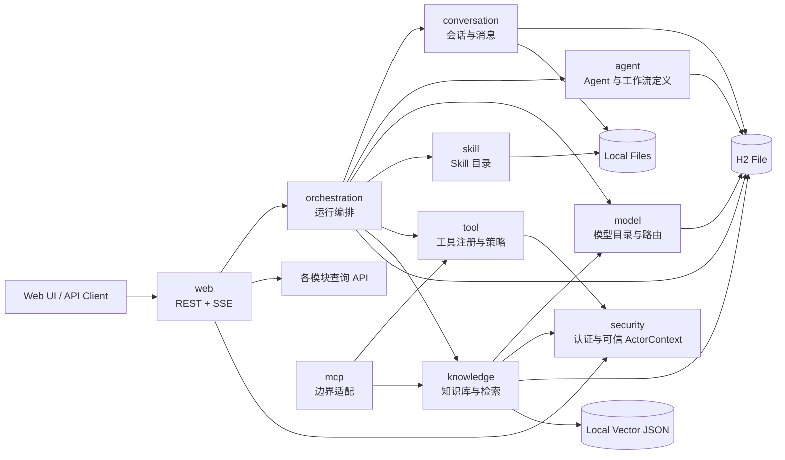
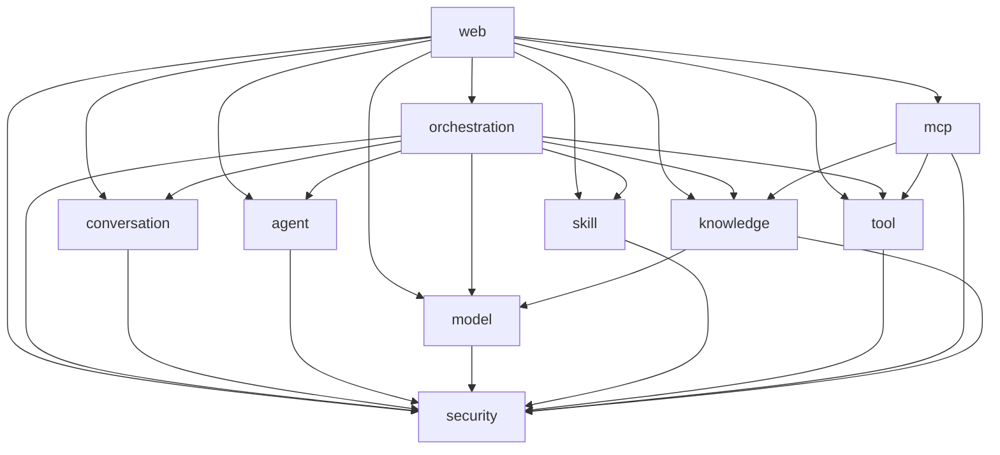
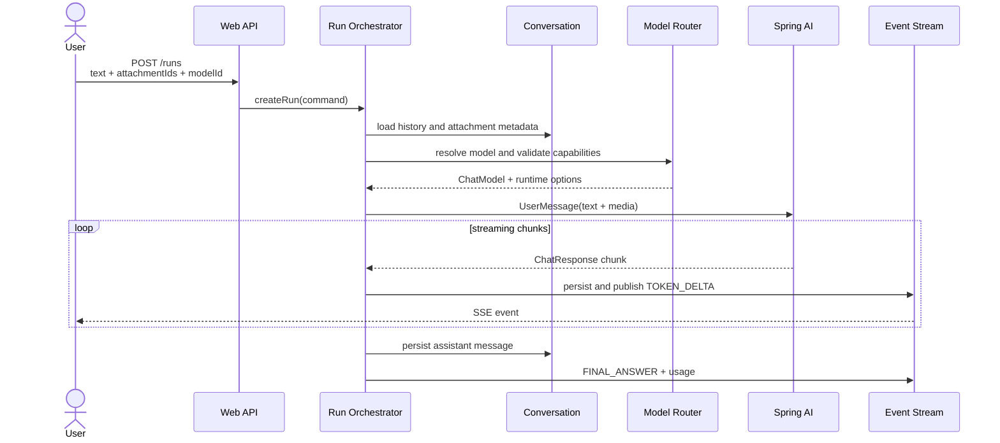
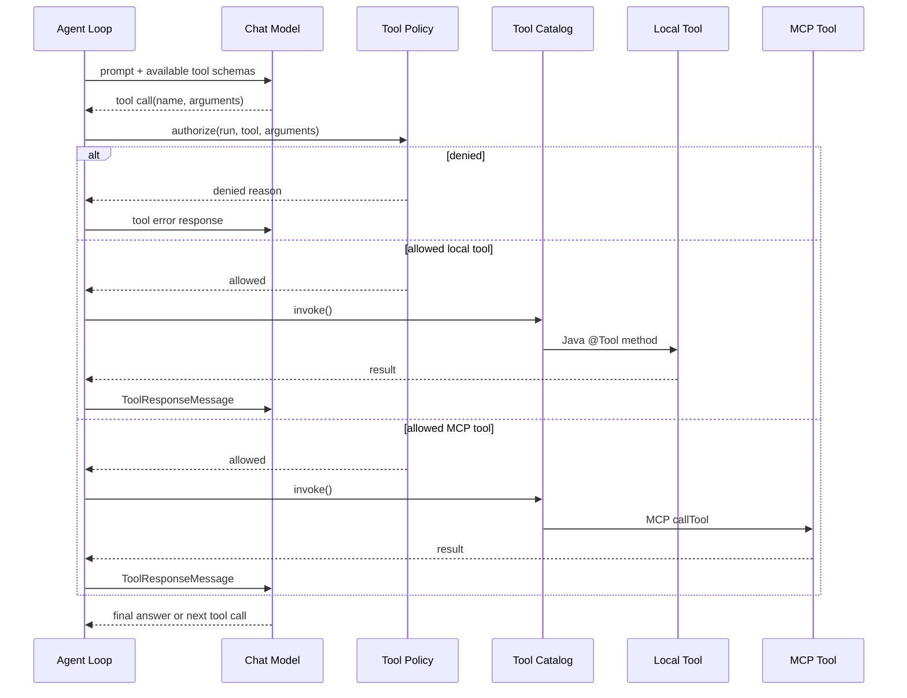
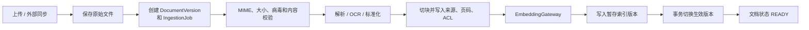
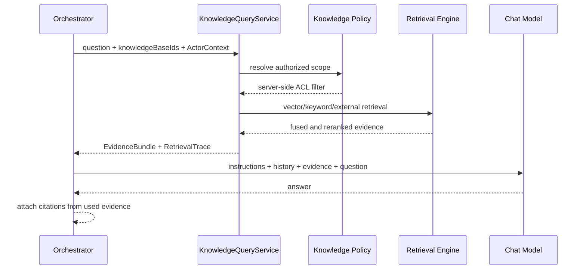
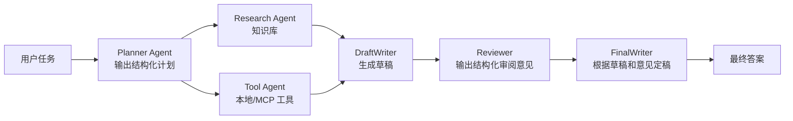

# Spring Agent Studio 总体架构设计

> 状态：Final  
> 本文是实现阶段的架构基线。若其他讨论或旧草案与本文冲突，以本文和
> [最终实现蓝图](implementation-blueprint.md)为准。

## 1. 项目定位

Spring Agent Studio 是一个可运行、可演示、可解释的 Java Agent 平台，用于展示大模型应用开发中的完整工程能力。

它不是一个“聊天接口套壳”。作品集需要让面试官能看到以下能力：

- 能把模型、工具、知识库和 Agent 编排分层；
- 能处理流式返回、超时、取消、重试、限额和审计；
- 能解释多 Agent 为什么这样协作，而不是把所有逻辑塞进 Prompt；
- 能在本机低成本启动，也预留生产化替换点；
- 能用自动化测试证明模块边界和关键链路正确。

首版项目名暂定为 `spring-agent-studio`，Java 根包暂定为 `io.github.yourname.agentstudio`。开始编码前应将 `yourname` 替换为你的 GitHub 用户名。

## 2. 技术选型

### 2.1 核心技术

| 类别 | 选择 | 原因 |
|---|---|---|
| Java | Java 21 LTS | 企业采用面广，具备虚拟线程、record、sealed class 和现代并发能力；比追逐最新非 LTS 更适合作品集 |
| 构建 | Gradle Kotlin DSL + Wrapper | 依赖声明类型安全；Wrapper 固定构建版本，使用者无需预装 Gradle |
| 应用框架 | Spring Boot 4.1.x | 当前 Spring 主线，自动配置、外部化配置、Actuator 和测试生态完整 |
| AI 框架 | Spring AI 2.0.0 | Spring 原生模型抽象，覆盖多模态、流式调用、工具、RAG、记忆和 MCP |
| 模块治理 | Spring Modulith 2.1.x | 在单体内校验模块依赖、禁止循环、生成模块文档，适合“简单部署 + 清晰架构” |
| Web | Spring MVC + Reactor 类型 | 普通管理接口使用熟悉的 MVC；聊天事件使用 `Flux<ServerSentEvent<?>>` 流式输出 |
| 持久化 | Spring Data JPA + H2 File | 首版无需安装数据库，且 JPA 是常见 Java 招聘技能 |
| 数据库迁移 | Flyway | 模式演进可追踪，未来切 PostgreSQL 时保留迁移纪律 |
| 向量存储 | `SimpleVectorStore` 本地文件 | 本地演示零中间件；明确只用于 local/demo profile |
| 文档解析 | Spring AI ETL + Tika Reader | 统一文档读取、切块、元数据和向量写入链路 |
| MCP | Spring AI MCP Client | 支持 STDIO 与 Streamable HTTP，并能适配为 Spring AI 工具 |
| 观测 | Actuator + Micrometer + 结构化日志 | 本地即可查看健康状态、耗时、token 和工具调用轨迹 |
| 测试 | JUnit 5、AssertJ、Mockito、Testcontainers（生产配置阶段） | 单元、模块、接口和真实基础设施测试分层 |

### 2.2 为什么选择 Spring AI，而不是同时引入 LangChain4j

LangChain4j 同样是优秀且活跃的 Java AI 框架，但首版同时引入两个上层 AI 抽象会造成：

- 两套 Message、Tool、Model、Memory 和 RAG 类型互相转换；
- 自动配置和生命周期边界不清晰；
- 面试时难以说明哪一层才是项目自己的架构；
- 依赖升级和故障定位成本增加。

本项目使用 Spring AI 作为唯一 AI 基础抽象。多 Agent 的工作流、运行状态、权限和事件模型由项目自己实现，这部分才是作品的核心价值。

### 2.3 版本策略

架构设计时的稳定基线：

```text
Java            21 LTS
Spring Boot     4.1.0
Spring AI       2.0.0
Spring Modulith 2.1.0
Gradle          9.6.1 Wrapper
```

具体补丁版本集中在 Gradle Version Catalog 中，不散落在各模块。升级时先跑单元测试、模块结构测试、契约测试和一个最小真实模型冒烟测试。

## 3. 总体形态：模块化单体

首版是一个进程、一个代码仓库、一个部署单元，内部按业务能力纵向分模块。



### 3.1 为什么不是微服务

当前没有需要独立扩缩容的真实负载，也没有跨团队所有权边界。过早拆分会立即引入服务发现、分布式追踪、消息中间件、分布式事务和多进程启动问题，反而削弱作品的可运行性。

模块化单体仍然保留清晰边界。未来只有满足以下条件之一才考虑拆分：

- 文档解析和向量化明显占用大量 CPU/内存，需要独立扩容；
- Agent Run 需要进入持久任务队列并由多节点消费；
- MCP 网关需要独立安全域；
- 模型代理需要统一限流、计费和多团队复用。

## 4. 模块划分

Java 包采用 Spring Modulith 的模块可见性规则：模块 base package 是默认公开 API，
其所有子包默认都属于模块内部。项目统一使用 `internal` 子包表达这一意图，但
`internal` 不是 Spring Modulith 的特殊关键字。需要公开的扩展接口通过
`@NamedInterface` 显式暴露。

```text
io.github.yourname.agentstudio
├── AgentStudioApplication.java
├── web
│   └── internal
│       ├── rest
│       │   └── ChatRunController.java
│       └── sse
├── security
│   ├── ActorContext.java
│   ├── CurrentActorProvider.java
│   └── internal
├── orchestration
│   ├── RunCommandService.java
│   ├── RunQueryService.java
│   └── internal
├── conversation
│   ├── ConversationService.java
│   ├── ConversationView.java
│   └── internal
├── agent
│   ├── AgentCatalog.java
│   ├── WorkflowCatalog.java
│   └── internal
├── model
│   ├── ModelCatalog.java
│   ├── ModelGateway.java
│   └── internal
├── tool
│   ├── ToolCatalog.java
│   ├── ToolPolicyService.java
│   └── internal
├── mcp
│   ├── McpConnectionService.java
│   └── internal
│       ├── client
│       ├── server
│       ├── knowledge
│       └── tools
├── knowledge
│   ├── KnowledgeCommandService.java
│   ├── KnowledgeQueryService.java
│   ├── KnowledgeJobQueryService.java
│   ├── EvidenceBundle.java
│   ├── spi
│   │   └── ExternalEvidenceProvider.java
│   └── internal
│       ├── application
│       ├── domain
│       ├── ingestion
│       ├── retrieval
│       ├── policy
│       ├── persistence
│       ├── objectstore
│       └── vector
└── skill
    ├── SkillCatalog.java
    └── internal
```

`knowledge` 是一个完整的一级业务模块。`ingestion`、`retrieval`、`policy`、
`persistence` 和 `vector` 都是它的内部组件，不是同级 Spring Modulith 模块。
只有出现独立扩缩容、独立团队所有权或独立安全域后，才考虑把摄取 Worker 或检索服务拆出进程。

### 4.1 模块职责

| 模块 | 负责 | 不负责 |
|---|---|---|
| `web` | DTO、参数校验、REST、SSE、异常映射 | Agent 决策、工具执行、仓储逻辑 |
| `security` | 认证适配、可信 `ActorContext`、平台级权限入口 | 代替各业务模块的数据权限规则 |
| `orchestration` | Run 生命周期、单/多 Agent 编排、事件流、取消、限额 | 模型厂商协议、文档解析 |
| `conversation` | 会话、消息、附件引用、消息历史 | Prompt 拼装和模型调用 |
| `agent` | Agent/Workflow 定义与校验 | 实际执行 |
| `model` | 模型配置、能力描述、运行时选择、模型实例 | 业务工作流 |
| `tool` | 工具目录、策略、审批和调用审计接口 | MCP 传输连接、知识检索实现 |
| `mcp` | MCP Client/Server、能力发现、重连、边界 DTO 与适配 | Agent 编排、复制知识检索逻辑 |
| `knowledge` | 知识库、文档版本、摄取任务、ACL、检索、重排和引用 | 对话状态、生成最终答案 |
| `skill` | Skill 文件加载、校验、版本、解析 | 任意脚本执行 |

### 4.2 允许的模块依赖



依赖方向必须保持：

```text
同进程本地知识查询：orchestration → knowledge
MCP 工具发现：mcp → tool::spi
外部 MCP 知识：mcp → knowledge::spi
对外暴露知识：mcp → KnowledgeQueryService
```

禁止 `tool → mcp` 和 `knowledge → mcp`。`tool` 定义工具扩展 SPI，`knowledge`
定义外部证据扩展 SPI，由 `mcp` 实现，从而保持源码依赖单向。

每个模块通过 `package-info.java` 的 `@ApplicationModule(allowedDependencies = …)`
声明允许依赖；仅绘制 Mermaid 图并不会让白名单自动生效。测试调用
`ApplicationModules.of(AgentStudioApplication.class).verify()`，使循环依赖、
越界访问和未声明依赖在构建期失败。

## 5. 核心领域模型

### 5.1 配置类对象

`ModelProfile`

- `id`
- `providerType`
- `baseUrl`
- `modelName`
- `credentialRef`：环境变量名称，不保存明文密钥
- `capabilities`：TEXT、VISION、AUDIO_INPUT、TOOLS、JSON_OUTPUT、EMBEDDING
- `defaultOptions`
- `enabled`

`AgentDefinition`

- `id`、`name`、`description`
- `systemPrompt`
- `defaultModelProfileId`
- `skillIds`
- `knowledgeBaseIds`
- `toolAllowList`
- `maxIterations`
- `timeout`
- `outputSchema`

`WorkflowDefinition`

- `id`、`name`、`strategy`
- `nodes`
- `edges`
- `entryNode`
- `resultNode`
- `failurePolicy`

首版支持四种策略：

1. `SINGLE`：单 Agent 问答。
2. `PIPELINE`：按固定 DAG 顺序执行，优先实现。
3. `PARALLEL`：多个 Agent 并行，最后聚合。
4. `SUPERVISOR`：监督 Agent 动态选择下一位 Worker，后续实现。

### 5.2 运行类对象

`AgentRun`

- 对应一次用户请求；
- 状态为 `CREATED/RUNNING/WAITING_APPROVAL/SUCCEEDED/FAILED/CANCELLED/TIMED_OUT`；
- 保存会话、工作流、模型选择和资源限额快照。

`AgentStep`

- 对应工作流中某个 Agent 的一次执行；
- 保存输入引用、输出、模型、token、耗时和错误。

`ToolInvocation`

- 保存工具名、来源、脱敏参数、结果摘要、风险等级、审批状态和耗时。

`RunEvent`

- 是后端到前端的统一事件信封；
- 事件类型包括 `RUN_STARTED`、`PLAN_CREATED`、`STEP_STARTED`、`TOKEN_DELTA`、`TOOL_CALL_REQUESTED`、`TOOL_RESULT`、`STEP_COMPLETED`、`FINAL_ANSWER`、`RUN_FAILED`；
- 带有递增序号，支持 SSE 断线后按 `Last-Event-ID` 补发。

## 6. 关键链路

### 6.1 单 Agent 多模态聊天



模型选择优先级：

```text
本次请求显式 modelId
        >
Agent 默认模型
        >
系统默认模型
```

选择后必须做能力校验。例如请求包含图片而模型没有 `VISION`，直接返回结构化错误和可选模型列表，不能把二进制静默丢弃。

### 6.2 工具调用链路



MVP 可先由 Spring AI 管理工具循环，但项目会在 `AgentLoop` 接口后封装它。需要人工审批、细粒度进度和自定义重试时，替换为项目控制的工具循环，不影响上层编排。

每次运行都有硬限制：

- 最大 Agent step 数；
- 单 step 最大工具调用次数；
- 总运行超时；
- 最大输入附件大小；
- 最大累计 token；
- 工具参数和结果日志脱敏。

### 6.3 知识库导入



上传接口只创建持久化摄取任务，不在 HTTP 请求内完成解析和向量化。首版使用
数据库中的 `ingestion_job` 加单进程 Worker，不需要 Kafka：

- 任务记录状态、租约、重试次数、错误码和管线版本；
- 解析、Embedding 等外部调用不占用长数据库事务；
- 应用重启后能够重新领取未完成任务；
- 新文档版本全部建立索引后才原子切换为生效版本；
- 将来可直接把 Worker 拆成独立进程，再按规模决定是否引入消息队列。

摄取幂等键至少包含：

```text
tenant + knowledgeBase + source + contentHash + parsingPipelineVersion
```

不能只按文件 SHA-256 跨租户复用，因为同一内容可能属于不同 ACL 和数据保留策略。
本地向量文件写入需要进程内写锁，并采用“写临时文件后原子替换”的方式，
避免进程中断造成文件损坏。`SimpleVectorStore` 只用于演示；`enterprise`
profile 使用 PostgreSQL + pgvector。

### 6.4 RAG 问答



`knowledge` 只返回证据，不负责调用聊天模型生成最终答案。最终回答属于
`orchestration`，避免知识模块与会话、Agent Prompt 和具体模型耦合。

权限过滤必须发生在向量/关键词检索之前，过滤条件由可信 `ActorContext`
在服务端生成。模型和客户端都不能传入或覆盖 `tenantId`、`userId`、部门或密级。
`ActorContext` 在 Web/MCP 认证边界创建，并显式传入异步任务；长时间 Run
不能依赖线程本地的 `SecurityContextHolder`。

首版本地配置可只实现向量检索；企业配置实现“关键词 + 向量 + 外部证据”
的融合检索和可选 Reranker。统一返回：

```json
{
  "items": [
    {
      "evidenceId": "…",
      "excerpt": "……",
      "relevance": 0.91,
      "citation": {
        "knowledgeBaseId": "…",
        "documentId": "…",
        "documentVersionId": "…",
        "chunkId": "…",
        "pageNumber": 8,
        "displayName": "architecture.pdf"
      }
    }
  ],
  "trace": {
    "strategy": "HYBRID",
    "candidateCount": 30,
    "resultCount": 6
  }
}
```

普通 RAG 问答由编排层确定性调用 `KnowledgeQueryService`。多跳研究 Agent
可以获得 `knowledge_search` Tool，但该 Tool 只能包装同一个服务，不能复制
一套检索、ACL 或引用逻辑。

### 6.5 多 Agent Pipeline

优先实现确定性的无环工作流。Reviewer 不直接退回原 Writer 节点，而是把审阅意见
交给新的 FinalWriter 节点，确保 Pipeline 仍然是合法 DAG。



每个节点只获得完成任务所需的最小上下文、工具和知识库。并行节点使用受限的任务执行器；首版不依赖消息队列。

需要 Reviewer 多轮返工的动态循环只在 `SUPERVISOR` 策略中实现，并由
`maxReviewRounds`、总 step、token 和超时共同限制；它不伪装成 DAG。

工作流输出通过结构化 POJO 传递，不靠解析自然语言标题：

```java
public record ResearchResult(
        String summary,
        List<Evidence> evidence,
        List<String> unresolvedQuestions) {
}
```

### 6.6 Skill 加载与应用

Skill 是声明式能力包，不等于 Tool，也不在首版执行任意脚本。

```text
data/skills/
└── deep-research/
    ├── SKILL.md
    └── references/
        └── citation-rules.md
```

`SKILL.md` 示例：

```markdown
---
name: deep-research
version: 1.0.0
description: 对复杂问题进行分步检索、证据整理和带引用回答
allowed-tools:
  - web_search
  - knowledge_search
required-capabilities:
  - TOOLS
---

# Instructions

先拆解问题，再收集证据。证据不足时明确说明，不得编造引用。
```

应用顺序：

```text
平台安全指令
  -> Agent system prompt
  -> 选中的 Skill 指令
  -> RAG 上下文
  -> 会话历史
  -> 当前用户消息
```

显式选择 Skill 优先。自动选择放到后续阶段，并保留选择原因和匹配分数。

### 6.7 MCP 连接

MCP 是系统边界适配层，不是同进程模块调用本地知识库的必经协议。

出站 MCP Client 连接两类 Server：

- 本地 STDIO：适合文件系统、Git 等本地能力；
- Streamable HTTP：适合远程工具和外部知识服务。

连接建立后完成能力发现，把 MCP Tool 转成统一 `RegisteredTool`。工具名加入连接前缀，避免多个 Server 出现同名工具。

```text
filesystem__read_file
github__search_issues
```

外部 MCP 知识服务通过 `knowledge::spi` 中的 `ExternalEvidenceProvider`
接入并统一转换为 `EvidenceBundle`。`knowledge` 不导入任何 MCP 类型。

入站 MCP Server 在后续里程碑把本系统能力提供给其他 Agent：

```text
外部 Agent
  → MCP Server Adapter
  → 认证并创建 ActorContext
  → KnowledgeQueryService / 受控 Tool
  → ACL、审计和限额
  → MCP Result
```

MCP Schema 是边界 DTO，不能直接暴露 JPA Entity、Spring AI `Document`、
VectorStore 或内部领域对象。

默认安全规则：

- MCP 连接默认关闭，显式启用；
- STDIO command 和参数来自受信配置，不接受聊天内容动态拼接；
- 每个 Agent 有工具 allow-list；
- 文件、网络、执行类工具标记风险等级；
- 敏感参数与工具结果不写入普通日志；
- MCP 超时、断线和重连不会无限阻塞 Agent Run；
- 远端必须支持用户委托身份或受控服务身份，否则只能标记为公共数据源；
- 模型提供的 `tenantId`、`userId` 或密级参数一律忽略；
- 低层 `McpClientRegistry` 不依赖 `knowledge` 或 `tool`，避免运行时 Bean 循环。

## 7. API 草案

### 7.1 Chat 与 Run

```text
POST   /api/v1/conversations
GET    /api/v1/conversations/{id}
POST   /api/v1/attachments

POST   /api/v1/runs
GET    /api/v1/runs/{id}
GET    /api/v1/runs/{id}/events
DELETE /api/v1/runs/{id}
POST   /api/v1/runs/{id}/approvals/{toolCallId}
```

`POST /runs` 创建运行并立即返回 `runId`；前端再连接事件 SSE。这样页面刷新或网络断开后仍能恢复，而不是把一次 HTTP 连接当作任务本身。

### 7.2 配置与能力

```text
GET/POST/PUT/DELETE /api/v1/models
GET/POST/PUT/DELETE /api/v1/agents
GET/POST/PUT/DELETE /api/v1/workflows
GET/POST/PUT/DELETE /api/v1/knowledge-bases
POST                /api/v1/knowledge-bases/{id}/documents
GET/POST/DELETE     /api/v1/skills
GET/POST/PUT/DELETE /api/v1/mcp-connections
GET                 /api/v1/tools
```

### 7.3 统一错误结构

```json
{
  "code": "MODEL_CAPABILITY_MISMATCH",
  "message": "所选模型不支持图片输入",
  "traceId": "…",
  "details": {
    "required": ["VISION"],
    "availableModelIds": ["…"]
  }
}
```

## 8. 持久化设计

### 8.1 H2 中的主要表

```text
conversation
message
attachment
model_profile
agent_definition
workflow_definition
agent_run
agent_step
run_event
tool_invocation
knowledge_base
source_document
document_version
ingestion_job
chunk_manifest
knowledge_acl
knowledge_index_version
skill_metadata
mcp_connection
outbox_event
```

Agent、Workflow 等可编辑定义使用乐观锁 `version` 字段。Run 创建时保存定义快照，
避免运行过程中配置被修改导致结果不可重现。知识文档通过 `document_version`
和 `knowledge_index_version` 实现完整索引后再切换；`ingestion_job` 和
`outbox_event` 让单进程任务在重启后仍可恢复。

### 8.2 本地数据目录

```text
data/
├── db/
│   └── agent-studio.mv.db
├── attachments/
│   └── {conversationId}/{attachmentId}
├── knowledge/
│   └── originals/{knowledgeBaseId}/{sourceId}
├── vector/
│   └── vector-store.json
└── skills/
    └── {skillName}/SKILL.md
```

文件名只作为展示元数据，实际路径使用服务端生成的 ID，防止路径穿越。

### 8.3 可替换接口

| 本地实现 | 接口 | 生产实现 |
|---|---|---|
| H2 | JPA Repository | PostgreSQL |
| SimpleVectorStore | Spring AI `VectorStore` | PGVector |
| LocalAttachmentStore | `BinaryObjectStore` | S3/MinIO |
| H2 RunEvent + InMemory 通知 | `RunEventBus` | PostgreSQL Outbox + Redis Stream/Kafka |
| H2 Job + 单机 Worker | `IngestionScheduler` | 独立 Worker + 持久任务队列 |

业务模块依赖接口，不读取具体 profile，也不写 `if (enterprise)`。

## 9. 模型切换设计

`ModelCatalog` 返回对外安全的模型信息，`ModelGateway` 根据 `ModelProfile` 创建或缓存 `ChatModel`/`EmbeddingModel`。

需要区分：

- Provider：OpenAI Compatible、Ollama、Anthropic、Google 等；
- Model：具体模型名称；
- Profile：Provider + endpoint + credentialRef + 默认参数 + 能力标签。

首版实现：

1. OpenAI-compatible provider；
2. Ollama provider；
3. 接口允许继续添加原生 Anthropic/Google provider。

切换模型不是简单替换 `model` 字符串。路由层还要处理：

- 不同 base URL 和密钥；
- 是否支持图片、音频、工具和结构化输出；
- 上下文窗口与输出上限；
- 价格/速率限制元数据；
- ChatModel 与 EmbeddingModel 不能混用；
- Agent 运行期间固定模型快照，不能中途被配置变更影响。

## 10. 并发、恢复与一致性

- Java 虚拟线程处理阻塞型模型/工具调用，Reactor 负责流式事件；
- 每个 Run 有独立取消令牌；
- 并行 Agent 数量由有界执行器限制；
- Run 事件先持久化再发布，保证断线可恢复；
- 应用重启后，`RUNNING` 状态标记为 `INTERRUPTED`，首版不自动续跑；
- 工具调用默认不重试非幂等操作；
- 模型瞬时错误只在还未输出内容时有限重试；
- 知识库导入按文件 hash 幂等；
- 本地向量存储写入串行化。

## 11. 安全边界

首版即使是本地演示，也必须保留以下边界：

- API key 只来自环境变量引用，响应和日志中不回显；
- 上传限制 MIME、扩展名、文件大小和总量；
- 文档读取不接受任意远程 URL；
- MCP STDIO 命令只能来自管理员配置；
- Tool 有 allow-list 和风险等级；
- Prompt、工具参数、模型响应日志支持关闭或脱敏；
- RAG 文档内容视为不可信数据，不能覆盖平台安全指令；
- 循环次数、运行时间、token 和工具结果大小都有上限。

认证分阶段：

- `local` profile：仅监听 localhost，可关闭登录，方便演示；
- `enterprise` profile：Spring Security OAuth2 Resource Server，所有数据带
  `tenantId`、主体、授权范围、密级和审计信息。

## 12. 观测与作品集展示

一次 Run 页面应能展示：

```text
总耗时 / 首 token 延迟 / 输入输出 token / 估算成本
选择的模型及原因
使用的 Agent 和工作流节点
检索到的知识片段与引用
工具调用参数摘要、结果和耗时
失败位置、错误类型和重试次数
```

建议指标：

- `agent.run.duration`
- `agent.run.count{status,strategy}`
- `agent.step.duration{agent,model}`
- `ai.tokens{model,direction}`
- `tool.invocation.duration{tool,status}`
- `rag.retrieval.duration`
- `rag.retrieval.documents`
- `mcp.connection.status`

所有日志带 `traceId`、`runId`、`conversationId`，但默认不记录完整用户内容。

## 13. 注释与代码可读性规范

注释目标是帮助学习设计，而不是制造噪声。

必须写清楚：

- 公开模块 API 的 Javadoc：用途、输入约束、失败语义；
- Agent 状态转换为什么合法或非法；
- 模型能力降级、重试和工具权限的设计原因；
- 并发、锁、事务边界和幂等策略；
- 与 Spring AI 行为有关但代码表面看不出的限制；
- `package-info.java` 中的模块职责和允许依赖。

不写以下注释：

```java
// 获取名称
public String getName() { ... }
```

推荐：

```java
/**
 * 为一次运行解析固定的模型快照。
 *
 * <p>返回快照而不是可变的 ModelProfile，是为了保证长时间运行的多 Agent
 * 工作流不会在管理员修改模型配置后中途切换 Provider。
 */
public ResolvedModel resolveForRun(ModelSelection selection) { ... }
```

每个复杂模块在测试中提供一个“可阅读的示例路径”，让学习者能从测试理解调用方式。

## 14. Gradle 工程形态

首版使用单 Gradle project，而不是为每个业务模块建立子 project。Spring Modulith 通过 Java 包边界治理模块，减少构建复杂度。

```text
spring-agent-studio/
├── build.gradle.kts
├── settings.gradle.kts
├── gradle/
│   └── libs.versions.toml
├── gradlew
├── gradlew.bat
├── src/
│   ├── main/
│   │   ├── java/
│   │   └── resources/
│   └── test/
└── docs/
```

只有出现独立发布的 SDK、MCP Server 或前端构建时，再增加 Gradle 子项目。

建议依赖分组：

```text
Spring Boot:
  web, webflux, validation, actuator, data-jpa, security
  oauth2-resource-server（enterprise）

Spring AI:
  spring-ai-openai, spring-ai-ollama（非 Starter，支持动态多 Profile）
  spring-ai-vector-store, spring-ai-tika-document-reader
  MCP Client / Server（M4）

Storage:
  h2, flyway

Architecture/Test:
  spring-modulith-core, spring-modulith-test,
  junit, assertj, mockito
```

服务端固定使用 Spring MVC。`webflux` 只提供 Spring AI 流式调用所需的
Reactor/WebClient 能力，不启动第二个 Web Server。核心 RAG 显式调用
`KnowledgeQueryService`，不使用 Advisor 黑盒绕过 ACL、引用和检索追踪。

禁止为了少写几行代码一次性引入大型通用工具包。新增依赖必须能说明用途、替代方案和运行影响。

## 15. 本地启动配置

默认 profile 的目标是：

```text
必需：JDK 21
可选：一个远程模型 API Key，或本地 Ollama
不需要：Docker、Redis、Kafka、PostgreSQL、向量数据库、对象存储
```

配置示意：

```yaml
app:
  data-dir: ./data
  ai:
    default-model: local-qwen
    models:
      local-qwen:
        provider: ollama
        base-url: http://localhost:11434
        model: qwen3
        capabilities: [TEXT, TOOLS]
      remote-model:
        provider: openai-compatible
        base-url: ${AI_BASE_URL}
        api-key: ${AI_API_KEY}
        model: ${AI_MODEL}
        capabilities: [TEXT, VISION, TOOLS, JSON_OUTPUT]
```

应用启动不强制连接全部模型和 MCP Server。连接检查作为健康子项展示，避免一个未配置的外部能力拖垮整个应用。

## 16. 主要风险与控制

| 风险 | 控制 |
|---|---|
| 多 Agent 变成无限循环 | 显式 DAG、状态机、最大 step/轮次/token/时间 |
| 模型切换后能力不一致 | ModelCapability 前置校验 |
| 工具调用造成副作用 | allow-list、风险等级、审批扩展点、非幂等不自动重试 |
| 流式连接断开导致任务丢失 | Run 与 SSE 分离、事件持久化、Last-Event-ID |
| 本地向量文件损坏 | 写锁、临时文件、原子替换、备份 |
| RAG 看似有引用实际不可追踪 | 引用使用结构化 source/chunk/page 元数据 |
| Skill 成为远程代码执行入口 | 首版仅声明式 Prompt/资源/工具白名单 |
| 模块化单体退化成大泥球 | Spring Modulith 构建校验和模块测试 |
| 依赖太多导致启动困难 | local profile 零中间件，生产能力按 profile 增量引入 |

## 17. 架构完成标准

进入编码阶段前，以下结论固定：

- 单部署单元的模块化单体；
- Java 21、Gradle Kotlin DSL、Spring Boot 4.1、Spring AI 2.0；
- Spring AI 作为唯一 AI 框架；
- `knowledge` 是单一业务模块，摄取、检索、权限和存储全部位于其内部；
- `web` 与 `mcp` 是边界适配模块，只能向内依赖业务能力；
- 模块 `package-info.java` 使用 `allowedDependencies` 固化依赖白名单；
- 多 Agent 先实现可追踪 Pipeline，再实现 Supervisor；
- Chat 使用 Run + SSE Event 两段式协议；
- local profile 使用 H2、本地文件和 SimpleVectorStore；
- enterprise profile 使用 PostgreSQL/pgvector、对象存储和 OAuth2/OIDC；
- 模型、向量库、对象存储和事件总线全部通过接口可替换；
- Skill 首版是声明式能力包；
- MCP Client 接入外部工具/知识，MCP Server 对外暴露受控能力；
- 同进程知识查询使用强类型 Java API，不绕行 MCP；
- 所有运行都有状态、事件、限额和审计。

## 18. 官方参考

- [Spring Boot](https://spring.io/projects/spring-boot/)
- [Spring Boot System Requirements](https://docs.spring.io/spring-boot/system-requirements.html)
- [Spring AI Getting Started](https://docs.spring.io/spring-ai/reference/getting-started.html)
- [Spring AI Chat Model API](https://docs.spring.io/spring-ai/reference/api/chatmodel.html)
- [Spring AI Multimodality](https://docs.spring.io/spring-ai/reference/api/multimodality.html)
- [Spring AI Tool Calling](https://docs.spring.io/spring-ai/reference/api/tools.html)
- [Spring AI RAG](https://docs.spring.io/spring-ai/reference/api/retrieval-augmented-generation.html)
- [Spring AI MCP](https://docs.spring.io/spring-ai/reference/api/mcp/mcp-overview.html)
- [Spring Modulith](https://docs.spring.io/spring-modulith/reference/index.html)
- [Gradle Java Toolchains](https://docs.gradle.org/current/userguide/toolchains.html)
- [Azure RAG Information Retrieval](https://learn.microsoft.com/azure/architecture/ai-ml/guide/rag/rag-information-retrieval)
- [AWS Generative AI Security Architecture](https://docs.aws.amazon.com/prescriptive-guidance/latest/security-reference-architecture-generative-ai/gen-ai-agents.html)
