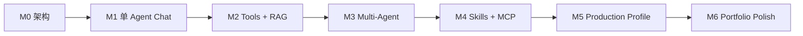

# 迭代计划与验收标准

## 总体顺序

项目按“每一阶段都能运行和演示”的方式推进。不要先写完所有基础设施再第一次联调模型。



## M0：架构与工程骨架

交付：

- Gradle Wrapper、Version Catalog、Java 21 Toolchain；
- Spring Boot 应用骨架；
- 按业务能力划分的 Spring Modulith 包；
- H2、Flyway、本地数据目录；
- 从第一版表结构开始包含 tenantId、主体引用和审计字段；
- Actuator 健康检查；
- 模块边界验证测试；
- local 配置模板和 README。

验收：

```text
gradlew clean test
gradlew bootRun
GET /actuator/health -> UP
未配置模型时应用仍可启动
```

## M1：单 Agent 流式聊天

交付：

- Conversation、Message、Attachment；
- ModelProfile 与运行时模型选择；
- OpenAI-compatible 与 Ollama 两个 Provider；
- 文本和图片输入；
- Run 状态机；
- SSE RunEvent；
- 取消、超时、token 使用量；
- 一个最小聊天页面。

验收：

- 可以新建会话并连续追问；
- 可以在同一会话的新 Run 中切换模型；
- 图片发送给无视觉能力模型时返回明确错误；
- 页面刷新后能读取历史消息；
- SSE 断开重连后能补发事件；
- 模型请求失败时 Run 最终状态不会一直停留在 RUNNING。

## M2：工具调用与知识库

交付：

- ToolCatalog 与 ToolPolicy；
- 两个安全本地工具，例如当前时间、受限知识搜索；
- ToolInvocation 轨迹；
- 音频输入：模型原生支持时直接发送，否则通过转写后进入统一问答链路；
- 单一 `knowledge` 模块的 Command/Query API；
- 持久化 IngestionJob、文档版本、解析、切块、嵌入和索引切换；
- tenant + knowledgeBase + source + hash + pipelineVersion 幂等；
- ACL 预过滤、EvidenceBundle、RAG 回答和结构化引用；
- RAG 相关测试。

验收：

- 能看到模型为什么调用哪个工具、输入摘要、结果和耗时；
- Agent 无权调用的工具不会执行；
- 同一个文档重复上传不会产生重复 chunk；
- 摄取中途重启不会让半成品索引生效；
- 未授权 Chunk 在进入模型前为零；
- 回答中的引用能定位到原文件和页码/片段；
- 删除知识库后相关向量不可被检索。

## M3：多 Agent

交付：

- AgentDefinition；
- WorkflowDefinition；
- Pipeline DAG 校验；
- Planner、Researcher、Writer、Reviewer 示例；
- 并行分支和聚合；
- 节点失败策略；
- 最大轮次、总超时、总 token 限制；
- Run Trace 页面。

验收：

- Pipeline 的每个 step 有独立输入、输出、模型和耗时；
- DAG 有环时保存失败；
- 并行节点不会超过配置的并发数；
- Pipeline 使用 `DraftWriter → Reviewer → FinalWriter`，保持无环；
- Supervisor 的动态返工最多允许固定次数；
- 任一节点失败后工作流按配置终止或降级；
- 最终回答可追溯到子 Agent 产物。

## M4：Skill 与 MCP

交付：

- `SKILL.md` frontmatter 和正文解析；
- Skill 热重载、版本和校验；
- Agent 显式绑定 Skill；
- MCP STDIO 与 Streamable HTTP；
- MCP 工具发现、命名前缀和 allow-list；
- MCP Client 通过 `knowledge::spi` 接入外部证据；
- MCP Server 复用 `KnowledgeQueryService` 对外暴露受控知识查询；
- 连接健康状态和超时；
- 高风险工具审批接口。

验收：

- 修改 Skill 后无需重启即可加载新版本；
- Skill 引用不存在的工具时给出校验错误；
- 两个 MCP Server 的同名工具不会冲突；
- MCP Server 断开不会拖死 Run；
- MCP 参数不能伪造 tenant、user 或密级；
- MCP 适配层不能复制知识 ACL 和检索实现；
- 未批准的高风险工具不会执行。

## M5：可选生产配置

交付：

- PostgreSQL + pgvector profile；
- Testcontainers 集成测试；
- Spring Security OAuth2/JWT Resource Server；
- tenantId、主体、部门和密级数据隔离；
- Prometheus 指标出口；
- Docker Compose 仅作为可选生产演示；
- 数据迁移说明。

验收：

- local profile 仍然不依赖 Docker；
- enterprise profile 可一键启动依赖；
- H2 与 PostgreSQL 的核心仓储契约测试一致；
- 知识库过滤不能跨租户、主体、部门或密级；
- 密钥、Prompt 和工具敏感参数不出现在日志中。

## M6：求职作品集完善

交付：

- 3 分钟演示脚本；
- 架构图和关键决策记录；
- 性能测试与结果；
- RAG 质量评估集；
- 故障注入演示；
- 中英文 README；
- 面试问题与设计权衡说明。

推荐演示场景：

1. 上传一组项目文档建立知识库；
2. 选择视觉模型分析一张架构图；
3. Planner 把任务拆给 Researcher 和 Tool Agent；
4. MCP Tool 获取外部数据；
5. Writer 生成回答，Reviewer 检查引用；
6. 页面展示完整事件、token、耗时和引用；
7. 切换成无视觉或无工具能力的模型，展示能力保护；
8. 暂停 MCP Server，展示超时和降级。

## 测试金字塔

```text
大量：领域单元测试、状态机测试、Prompt 组装测试
适量：Spring Modulith 模块测试、Repository 测试、Controller 测试
少量：真实模型/MCP/pgvector 集成测试
极少：端到端 UI 测试
```

真实模型测试单独打标签，默认构建不消耗 API 额度。
