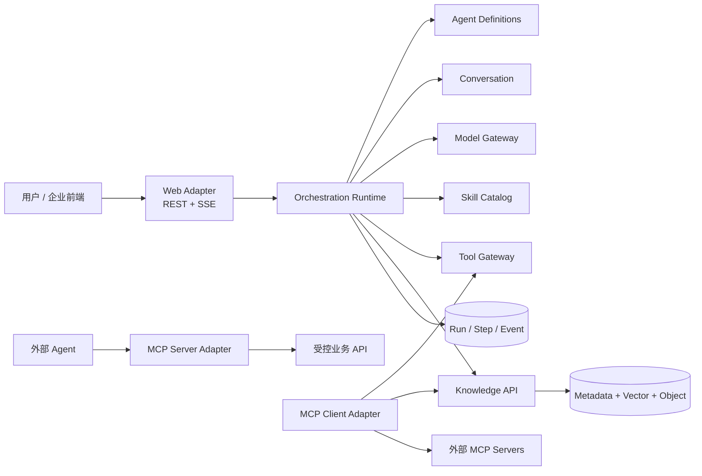
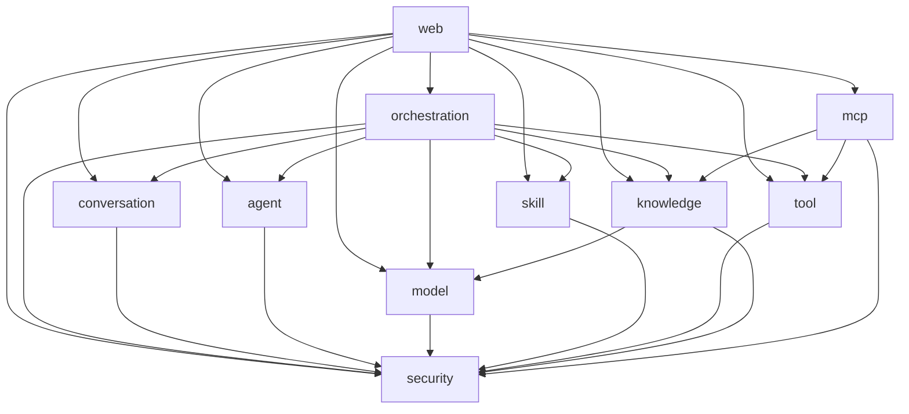
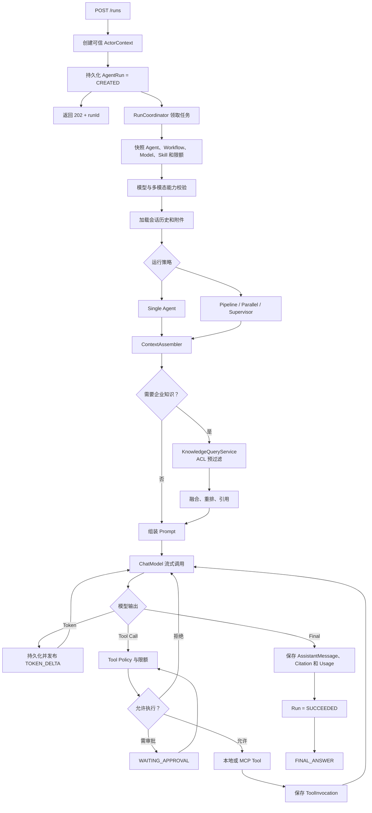

# CycberCompany 最终实现蓝图

> 状态：Final  
> 目标：按企业架构标准实现，同时保留本地一条命令启动能力。

## 1. 最终决策

| 主题 | 最终方案 |
|---|---|
| 部署形态 | 单 Gradle Project、单 Spring Boot 进程、Spring Modulith 模块化单体 |
| Java | Java 21 LTS，Gradle Java Toolchain |
| Spring | Spring Boot 4.1、Spring AI 2.0、Spring Modulith 2.1 |
| Agent | 项目自研可持久化 Run/Step 状态机，Spring AI 负责模型、工具和 RAG 基础抽象 |
| 多 Agent | 先实现确定性 Pipeline DAG，再实现 Parallel 和 Supervisor |
| 问答协议 | `POST /runs` 创建持久 Run，`GET /runs/{id}/events` 使用 SSE 获取事件 |
| 知识库 | 一个 `knowledge` 业务模块，摄取、检索、权限、存储都是其内部组件 |
| 本地知识调用 | `orchestration → KnowledgeQueryService` 强类型 Java API |
| MCP | 边界适配模块；Client 接外部工具/知识，Server 对外暴露受控能力 |
| 本地存储 | H2 File、本地对象目录、SimpleVectorStore、数据库任务表 |
| 企业存储 | PostgreSQL + pgvector、S3/MinIO、OAuth2/OIDC；OpenSearch 和消息队列按规模引入 |
| 安全 | 可信 `ActorContext` 显式传播，知识 ACL 在检索前执行，工具执行前授权 |
| 架构治理 | `package-info.java` 的 `allowedDependencies` + `ApplicationModules.verify()` |

## 2. 系统上下文



`web` 和 `mcp` 是边界适配模块；`orchestration` 是运行协调者；其他模块拥有各自
领域数据和用例。任何核心模块都不能依赖 `web`，`knowledge` 和 `tool` 也不能依赖 `mcp`。

## 3. 最终一级模块

```text
io.github.yourname.cycbercompany
├── CycberCompanyApplication.java
├── security
├── conversation
├── agent
├── model
├── skill
├── tool
├── knowledge
├── mcp
├── orchestration
└── web
```

| 模块 | 对外提供 |
|---|---|
| `security` | `ActorContext`、当前主体解析、平台授权入口 |
| `conversation` | 会话、消息、附件的 Command/Query API |
| `agent` | Agent 与 Workflow 定义、版本和 DAG 校验 |
| `model` | 模型目录、能力校验、Chat/Embedding/Rerank Gateway |
| `skill` | Skill 加载、版本、校验和查询 |
| `tool` | Tool Catalog、Tool Provider SPI、授权、审批和审计 |
| `knowledge` | 知识管理、摄取任务、证据检索、外部证据 SPI |
| `mcp` | MCP 连接管理、Client/Server 边界适配 |
| `orchestration` | Run 创建、状态机、Agent Loop、多 Agent 工作流、事件 |
| `web` | REST、SSE、上传、异常映射、静态演示 UI |

## 4. 最终模块依赖



明确禁止：

```text
任何模块   -X-> web
tool       -X-> mcp
knowledge  -X-> mcp
model      -X-> knowledge
agent      -X-> orchestration
```

`agent` 保存 `modelId`、`skillId`、`knowledgeBaseId` 和 `toolName` 等不透明引用，
由 `orchestration` 在 Run 准备阶段统一解析和校验，避免 `agent` 反向依赖所有能力模块。

## 5. Spring Modulith 的代码约束

每个一级模块都提供 `package-info.java`。例如：

```java
@org.springframework.modulith.ApplicationModule(
        allowedDependencies = {"security", "model"}
)
package io.github.yourname.cycbercompany.knowledge;
```

知识库扩展接口使用 Named Interface：

```java
@org.springframework.modulith.NamedInterface("spi")
package io.github.yourname.cycbercompany.knowledge.spi;
```

MCP 模块允许依赖：

```java
@org.springframework.modulith.ApplicationModule(
        allowedDependencies = {
                "security",
                "tool :: spi",
                "knowledge",
                "knowledge :: spi"
        }
)
package io.github.yourname.cycbercompany.mcp;
```

模块测试：

```java
class ModularityTests {

    @Test
    void verifiesModuleBoundaries() {
        ApplicationModules.of(CycberCompanyApplication.class).verify();
    }
}
```

注意：模块 base package 是默认公开 API，所有子包默认内部。`internal` 是统一命名约定，
不是框架特殊关键字。Controller 必须放在 `web.internal.rest`，不能无意成为公开模块 API。

## 6. 推荐 Java 包结构

```text
knowledge
├── package-info.java
├── KnowledgeCommandService.java
├── KnowledgeQueryService.java
├── KnowledgeJobQueryService.java
├── EvidenceBundle.java
├── KnowledgeBaseView.java
├── IngestionJobView.java
├── spi
│   ├── package-info.java
│   └── ExternalEvidenceProvider.java
└── internal
    ├── application
    │   ├── DefaultKnowledgeCommandService.java
    │   └── DefaultKnowledgeQueryService.java
    ├── domain
    │   ├── KnowledgeBase.java
    │   ├── SourceDocument.java
    │   ├── DocumentVersion.java
    │   ├── IngestionJob.java
    │   └── KnowledgeAcl.java
    ├── ingestion
    │   ├── IngestionWorker.java
    │   ├── DocumentParser.java
    │   ├── DocumentChunker.java
    │   └── DocumentIndexer.java
    ├── retrieval
    │   ├── RetrievalEngine.java
    │   ├── ResultFusion.java
    │   ├── EvidenceReranker.java
    │   └── CitationBuilder.java
    ├── policy
    │   └── KnowledgeAccessPolicy.java
    ├── persistence
    ├── vector
    └── objectstore
```

```text
orchestration
├── package-info.java
├── RunCommandService.java
├── RunQueryService.java
├── RunView.java
└── internal
    ├── runtime
    │   ├── RunCoordinator.java
    │   ├── RunStateMachine.java
    │   └── RunRecoveryService.java
    ├── workflow
    │   ├── WorkflowCompiler.java
    │   ├── PipelineExecutor.java
    │   ├── ParallelExecutor.java
    │   └── SupervisorExecutor.java
    ├── agentloop
    │   ├── AgentStepExecutor.java
    │   ├── ContextAssembler.java
    │   └── PolicyAwareToolLoop.java
    ├── event
    │   ├── RunEventStore.java
    │   └── RunEventPublisher.java
    └── tools
        └── KnowledgeSearchToolAdapter.java
```

```text
mcp
├── package-info.java
├── McpConnectionService.java
└── internal
    ├── client
    │   └── McpClientRegistry.java
    ├── tools
    │   └── McpToolProvider.java
    ├── knowledge
    │   └── McpExternalEvidenceProvider.java
    └── server
        └── KnowledgeMcpServerAdapter.java
```

`McpClientRegistry` 只负责连接和协议生命周期，不依赖 `tool` 或 `knowledge`。
上层适配器组合 Registry 与相应 SPI，避免运行时 Bean 循环。

## 7. 核心问答接口

### 7.1 创建 Run

```http
POST /api/v1/runs
Content-Type: application/json
```

```json
{
  "conversationId": "…",
  "text": "请结合项目知识库回答",
  "attachmentIds": ["…"],
  "modelProfileId": "…",
  "agentId": "…",
  "workflowId": null
}
```

响应使用 `202 Accepted`：

```json
{
  "runId": "…",
  "status": "CREATED",
  "eventsUrl": "/api/v1/runs/…/events"
}
```

### 7.2 订阅事件

```http
GET /api/v1/runs/{runId}/events
Accept: text/event-stream
Last-Event-ID: 17
```

事件类型：

```text
RUN_STARTED
PLAN_CREATED
STEP_STARTED
RETRIEVAL_COMPLETED
TOKEN_DELTA
TOOL_CALL_REQUESTED
APPROVAL_REQUIRED
TOOL_RESULT
STEP_COMPLETED
FINAL_ANSWER
RUN_FAILED
RUN_CANCELLED
```

业务状态事件先写入 `run_event`，再发布到进程内 SSE Sink。Token 不逐个写事务，
而是按 50–100ms 或字符阈值合并成 `TOKEN_DELTA` 批次持久化。重连时先按序号
回放数据库事件，然后切换到实时流，避免一次回答产生数千次事务，也避免把一条
HTTP 长连接当作任务本身。

## 8. 核心问答执行链路



模型调用、工具循环和多 Agent step 都受以下硬限制：

- 总运行超时；
- 最大工作流节点数和返工次数；
- 单 step 最大工具调用次数；
- 最大输入、输出和累计 token；
- 最大附件和工具结果大小；
- 外部 MCP 超时、并发和结果条数；
- 用户取消令牌。

## 9. Agent 与工作流实现

`AgentDefinition` 保存：

```text
systemPrompt
defaultModelProfileId
skillIds
knowledgeBaseIds
toolAllowList
maxIterations
timeout
outputSchema
version
```

`WorkflowDefinition` 保存版本化执行定义：

```text
nodes: agentId、dependsOn、inputMapping、outputKey、failurePolicy
strategy: SINGLE / PIPELINE / PARALLEL / SUPERVISOR
limits: maxSteps、maxParallelism、timeout
```

实现顺序：

1. `SINGLE`；
2. `PIPELINE`；
3. `PARALLEL`；
4. `SUPERVISOR`。

`WorkflowCompiler` 在保存和执行前检查节点引用、DAG 无环、唯一输出键和上限。
运行时保存定义快照，配置更新不影响正在执行的 Run。

`PIPELINE` 和 `PARALLEL` 必须是无环 DAG，示例使用
`DraftWriter → Reviewer → FinalWriter`。只有 `SUPERVISOR` 可以动态返工，
并额外使用 `maxReviewRounds`、总 step、token 和超时形成硬边界。

工具阶段采用项目控制的 `PolicyAwareToolLoop`，底层复用 Spring AI 模型和工具抽象。
这样才能在工具执行前暂停审批、记录每轮事件，并对非幂等工具禁止自动重试。

## 10. 知识库实现

### 10.1 公开契约

```java
public interface KnowledgeQueryService {

    EvidenceBundle search(
            KnowledgeSearchCommand command,
            ActorContext actor);
}
```

```java
public interface KnowledgeCommandService {

    KnowledgeBaseView createKnowledgeBase(
            CreateKnowledgeBaseCommand command,
            ActorContext actor);

    IngestionJobView ingest(
            IngestDocumentCommand command,
            ActorContext actor);

    void deleteDocument(
            DeleteDocumentCommand command,
            ActorContext actor);
}
```

公开 API 不允许出现：

- JPA Entity；
- Spring AI `Document`、`VectorStore`；
- MCP 类型；
- 模型厂商 SDK；
- 可由客户端填写的可信租户、用户或权限等级。

### 10.2 摄取

```text
原文件
→ DocumentVersion
→ IngestionJob
→ 校验
→ 解析/OCR
→ 切块 + ACL 元数据
→ Embedding
→ 暂存索引版本
→ 原子切换
→ READY
```

摄取任务使用数据库租约领取，不把解析和 Embedding 包在长事务中。失败按错误类型控制重试；
新索引未完成前继续查询旧版本，禁止半成品对用户可见。

### 10.3 检索

```text
可信 ActorContext
→ 服务端 ACL Filter
→ 向量检索 + 关键词检索 + 受控外部证据
→ 融合去重
→ Rerank
→ Prompt Injection/敏感内容标记
→ EvidenceBundle
```

`EvidenceBundle` 必须能定位 `knowledgeBaseId/documentId/documentVersionId/chunkId/page`。
知识库不生成最终自然语言答案。

## 11. MCP 实现

### 11.1 出站工具

```text
McpClientRegistry
→ McpToolProvider implements tool::spi
→ Tool Catalog
→ Agent Tool Loop
```

工具名使用连接前缀；按连接、工具名、风险等级和 Agent allow-list 过滤。

### 11.2 出站知识

```text
McpExternalEvidenceProvider implements knowledge::spi
→ McpClientRegistry
→ 外部 MCP knowledge_search
→ 规范化 Evidence
```

远端不支持用户委托身份或服务端 ACL 时，只允许配置为公共知识源。

### 11.3 入站 MCP Server

```text
外部 Agent
→ MCP Auth
→ ActorContext
→ KnowledgeQueryService / 受控 Tool
→ MCP Result
```

MCP 只是边界协议。未来拆出 Knowledge Service 后，后端内部使用版本化 REST/gRPC；
MCP 保留给 Agent 生态互操作。

## 12. 数据模型

```text
security:
  tenant, actor_mapping（需要本地身份时）

conversation:
  conversation, message, attachment

configuration:
  model_profile, agent_definition, workflow_definition,
  skill_metadata, mcp_connection

runtime:
  agent_run, agent_step, run_event, tool_invocation

knowledge:
  knowledge_base, source_document, document_version,
  ingestion_job, chunk_manifest, knowledge_acl,
  knowledge_index_version

reliability:
  outbox_event
```

关键规则：

- 所有租户数据以 `tenant_id` 作为强制过滤条件；
- 可编辑定义带乐观锁版本；
- Run 保存配置快照；
- 文档更新创建新版本，不覆盖旧版本；
- 删除先停止检索，再按保留期物理清理；
- 密钥只保存 `credentialRef`，不保存明文。

## 13. 运行配置

### local

```text
一个 Spring Boot 进程
H2 File
本地对象目录
SimpleVectorStore JSON
数据库 Ingestion Worker
数据库 RunEvent + 进程内 SSE
本地 ActorContext
MCP 默认关闭
```

目标启动命令：

```powershell
.\gradlew.bat bootRun
```

本机需要 JDK 21；Gradle Wrapper 负责准备 Gradle 本身，不假设 Toolchain 会在未配置
下载仓库时自动安装 JDK。

### enterprise

```text
Spring Boot 应用
PostgreSQL + pgvector
S3/MinIO
企业 OIDC / OAuth2 Resource Server
Micrometer Tracing + OTLP
MCP Streamable HTTP + OAuth2/mTLS
```

第一版企业配置仍不强制 Redis、Kafka 或 OpenSearch。只有出现多实例任务竞争、事件吞吐
或关键词检索质量要求时再引入：

```text
OpenSearch：混合检索的关键词侧
Redis：短期状态、分布式限流或 SSE fan-out
Kafka/队列：跨进程摄取和 Run 调度
```

## 14. Gradle 最小依赖集合

```text
Spring Boot:
  web
  webflux（Spring AI 流式调用与 Reactor 类型）
  validation
  data-jpa
  actuator
  security
  oauth2-resource-server

Spring AI:
  spring-ai-bom
  spring-ai-openai（非 Starter，由 ModelProviderFactory 创建）
  spring-ai-ollama（非 Starter，由 ModelProviderFactory 创建）
  VectorStore API
  Tika Document Reader
  MCP Client / Server

Storage:
  H2
  PostgreSQL Driver
  Flyway

Architecture/Test:
  Spring Modulith Core/Test
  JUnit 5
  AssertJ
  Mockito
  Testcontainers（enterprise profile）
```

首版不引入 Lombok、MapStruct、Redis、Kafka、Elasticsearch/OpenSearch 客户端或工作流引擎。
Java record、手工映射和项目自己的有限状态机更容易学习、调试和面试讲解。

应用同时包含 `spring-boot-starter-web` 和 Spring AI 流式调用所需的 Reactive
客户端支持时，服务端应用类型固定为 Servlet/MVC；WebFlux 只提供 Reactor/WebClient
能力，不启动第二套 HTTP Server。

## 15. 测试门禁

| 测试 | 必须证明 |
|---|---|
| Modulith Verification | 无循环、无 internal 越界、无白名单外依赖 |
| Run State Machine | 所有状态转换、取消、超时、审批和恢复合法 |
| Model Contract | 切换模型、能力不匹配、流式错误行为一致 |
| Tool Policy | 未授权工具零执行，非幂等工具不自动重试 |
| Knowledge ACL | 未授权 Chunk 在进入模型前为零 |
| Ingestion Recovery | 重启、重复提交、部分索引失败不会产生半生效版本 |
| Citation | 每条 Evidence 可定位文档版本、Chunk 和页码 |
| MCP Contract | 伪造 tenant/user 无效，超时不会卡死 Run |
| SSE Recovery | Last-Event-ID 能准确回放且不重复最终事件 |
| Repository Contract | H2 与 PostgreSQL 实现保持相同行为 |

真实模型、MCP 和 pgvector 测试单独使用 Gradle tag，默认构建不消耗外部额度。

## 16. 实施顺序

### M0：工程和边界

- Gradle Wrapper、Version Catalog、Java 21 Toolchain；
- Spring Boot、Spring Modulith 包和 `allowedDependencies`；
- H2、Flyway、Actuator；
- local/enterprise 配置骨架；
- 从首张表开始包含 `tenantId`、主体引用和审计字段；
- 模块验证测试。

### M1A：最小聊天纵向链路

- Conversation、Message、AgentRun、RunEvent；
- 一个 OpenAI-compatible ModelProfile；
- `POST /runs → 202`、持久事件和 SSE；
- FakeModelGateway 完整接口测试；
- 无模型密钥时应用仍能启动。

### M1B：模型切换与多模态

- Model Catalog、运行快照和 Ollama；
- Attachment、本地文件存储、图片输入和视觉能力校验；
- 取消、超时、首 token 延迟、usage；
- SSE Last-Event-ID 回放。

### M2A：受控工具循环

- PolicyAwareToolLoop、Tool Catalog、Tool Policy；
- 低风险本地工具、allow-list、超时和调用次数上限；
- ToolInvocation 审计；
- 人工审批状态及接口。

### M2B：知识库与音频

- Knowledge Command/Query API；
- 持久化 IngestionJob；
- 文档版本、解析、切块、Embedding、索引；
- ACL 预过滤、EvidenceBundle、引用；
- local VectorStore 和 enterprise PGVector 契约；
- 模型原生音频输入，或转写后进入统一问答链路。

### M3：多 Agent

- Pipeline、Parallel；
- Planner/Researcher/ToolAgent/DraftWriter/Reviewer/FinalWriter 示例；
- 限额、失败策略和运行追踪。

### M4：Skill 与 MCP

- 声明式 Skill；
- MCP Client 工具和外部证据；
- MCP Server 暴露知识查询；
- 连接健康、超时、过滤和身份传播。

### M5：企业加固

- OAuth2/OIDC、租户与 ABAC；
- PostgreSQL/pgvector、对象存储；
- Outbox、恢复和 Testcontainers；
- 指标、Tracing、质量评估和安全测试。

## 17. 架构验收标准

进入正式功能编码后，任何实现都必须满足：

1. 一条命令可以启动 local profile；
2. 业务模块不暴露 Spring AI、JPA、MCP 或厂商 SDK 类型；
3. `knowledge` 始终是一个业务模块，内部实现不可被其他模块绕过；
4. MCP 依赖方向只能是 `mcp → tool/knowledge`；
5. 权限身份来自认证边界并显式传播，模型不能构造可信身份；
6. Run、摄取任务和事件都可持久恢复；
7. 多 Agent 工作流有界、可取消、可审计；
8. 所有最终回答能关联模型、Agent step、工具调用和知识引用；
9. enterprise profile 的基础设施替换不修改业务用例；
10. 架构测试、单元测试和关键集成测试全部通过。
