# CycberCompany 新手学习手册

这份文档写给第一次接触 Spring Boot、JPA、SSE 和 AI Agent 的 Java 开发者。
目标不是让你立刻读完所有类，而是建立一张地图：知道项目解决什么问题、一次请求经过哪些层、
每个功能应该去哪里找，以及如何通过测试验证自己的理解。

## 1. 项目到底是什么

CycberCompany 是一个“模块化单体”后端：

- 一个 Spring Boot 进程；
- 一个 Gradle 工程；
- 多个按业务能力划分的 Java 包；
- H2 保存本地数据；
- Agent Run 负责把用户请求变成可恢复、可审计的执行任务；
- 模型、知识库、工具、MCP 和本机节点都通过明确的模块边界连接起来。

可以先记住一句话：

> `web` 接收请求，`orchestration` 编排 Run，其他模块提供能力，`node` 在真实电脑上执行动作。

## 2. 从哪里开始读

推荐按下面的顺序阅读：

1. `build.gradle.kts`：看 Java 版本和 Spring 依赖。
2. `CycberCompanyApplication`：看应用从哪里启动。
3. `web/CycberCompanyController`：看 HTTP API 如何进入业务层。
4. `conversation/ConversationService`：理解会话和消息的最小模型。
5. `orchestration/RunCommandService`：理解一次 Run 如何创建、排队、执行和结束。
6. `orchestration/RunEventPublisher` 与 `web/CycberCompanyController` 的 SSE 方法：理解流式输出。
7. `model/ModelCatalog` 与 `model/ModelGateway`：理解模型配置和调用。
8. `tool/ToolRouter`：理解工具为什么不能直接交给模型。
9. `knowledge/KnowledgeCommandService` 与 `KnowledgeQueryService`：理解文档导入和检索。
10. `node/NodeService` 与 `cycbercompany-node-java`：理解本机文件、Shell、浏览器动作如何被远程控制。

不要一开始从最大的 `RunCommandService` 第一行读到最后一行。先看本文的流程图，
再带着一个具体问题回到代码里，例如“用户发送一条消息后，助手回答是怎么回到浏览器的”。

## 3. 技术栈和目录

| 技术 | 在项目中的用途 |
|---|---|
| Java 21 | 主语言，使用 record、Stream、现代时间 API 等特性 |
| Spring Boot | 启动应用、依赖注入、MVC、配置和定时任务 |
| Spring Data JPA | 用 Java Entity 和 Repository 访问 H2 |
| H2 | 本地开发数据库，默认不需要安装独立数据库 |
| Spring Modulith | 校验业务包之间的依赖方向 |
| Gradle Kotlin DSL | 编译、运行和测试 |
| SSE | 把 Run 的 token 和状态事件持续推送给前端 |
| WebSocket | 后端和 Java 节点之间的长连接 |
| Jackson | JSON 序列化、反序列化和配置读取 |
| Apache POI / PDFBox | 解析 Office 和 PDF 文档 |

核心目录：

```text
cycbercompany-backend/
├── build.gradle.kts                 # 依赖和构建任务
├── src/main/java/.../cycbercompany/
│   ├── web/                          # REST、SSE、异常映射
│   ├── orchestration/                # Run 生命周期和 Agent 编排
│   ├── conversation/                 # 会话、消息、附件
│   ├── agent/                        # Agent 定义
│   ├── model/                        # 模型 Profile 和网关
│   ├── tool/                         # 统一工具目录和权限交集
│   ├── knowledge/                    # 文档、切块、Embedding、检索
│   ├── skill/                        # Skill 安装、解析和 Release 快照
│   ├── mcp/                          # MCP 连接和外部工具
│   ├── node/                         # 节点注册、审批、调用和审计
│   ├── artifact/                     # 截图、Trace 等文件
│   ├── security/                     # ActorContext 和认证适配
│   └── config/                       # 配置、Seeder、HTTP 客户端
├── src/main/resources/
│   └── application.yml               # 默认配置
├── src/test/java/                    # 单元、集成和模块测试
├── cycbercompany-node-java/            # 运行在本机/服务器上的 Java 节点
└── docs/                             # 架构、实现计划和学习文档
```

## 4. 本地运行

### 4.1 环境准备

- JDK 21；
- Windows 可以直接使用 `gradlew.bat`；
- 一个 OpenAI-compatible 模型服务和 API Key，或者使用项目已有的本地配置；
- 节点功能需要额外启动 `cycbercompany-node-java`。

不要把 API Key 写进 Java 代码或 YAML。PowerShell 示例：

```powershell
$env:EDGEFN_API_KEY="你的密钥"
.\gradlew.bat bootRun
```

健康检查：

```powershell
Invoke-RestMethod http://localhost:8080/actuator/health
```

运行测试：

```powershell
.\gradlew.bat test
```

测试使用 `src/test/resources/application.yml`，通常指向内存 H2，不会污染本地 `data` 目录。

### 4.2 最小聊天请求

先创建会话：

```powershell
$conversation = Invoke-RestMethod -Method Post `
  -Uri http://localhost:8080/api/v1/conversations `
  -ContentType application/json `
  -Body '{"title":"新手学习"}'
```

再创建 Run：

```powershell
$run = Invoke-RestMethod -Method Post `
  -Uri http://localhost:8080/api/v1/runs `
  -ContentType application/json `
  -Body (@{
    conversationId = $conversation.id
    text = "请介绍这个项目的模块划分"
  } | ConvertTo-Json)
```

`POST /runs` 返回 `202 Accepted`，表示任务已经保存并入队，不代表模型已经回答完成。
前端继续连接：

```text
GET /api/v1/runs/{runId}/events
```

## 5. 总体请求链路

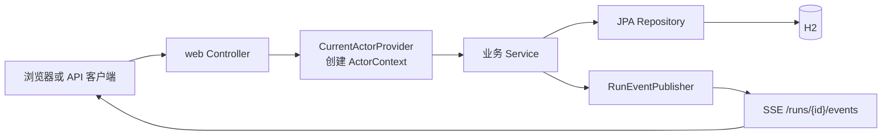

读代码时，把 `Controller` 看成“翻译层”：

- HTTP JSON 翻译为 `CreateRunCommand`、`KnowledgeSearchCommand` 等命令对象；
- 当前请求翻译为可信 `ActorContext`；
- 业务结果翻译为 HTTP JSON、文件下载或 SSE；
- Controller 不应该自己写复杂业务规则。

## 6. 会话和消息

会话功能解决的是“聊天记录保存在哪里”，不是“模型如何回答”。

主要类：

- `ConversationEntity`：数据库中的会话；
- `MessageEntity`：数据库中的消息；
- `ConversationRepository`：会话查询；
- `MessageRepository`：消息查询；
- `ConversationService`：创建、读取、归档和追加消息；
- `ConversationView`、`MessageView`：返回给 API 的视图对象。

流程：

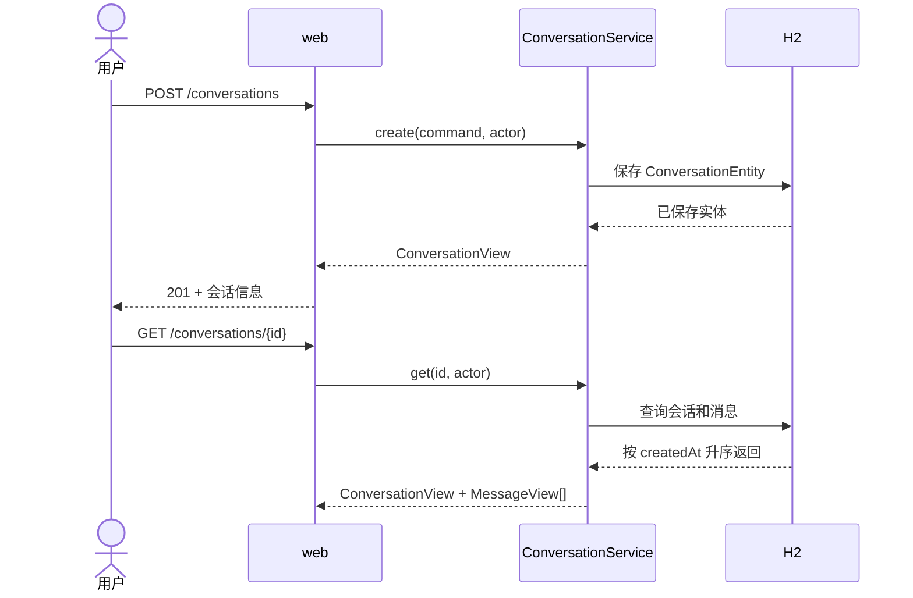

新手需要注意：

- 每次查询都带 `tenantId`，避免只凭 ID 跨租户读取；
- 归档会话可以读取，但不能追加新的用户消息；
- 用户消息的 `runId` 用来把一条消息和一次执行关联起来。

## 7. Run：项目最核心的执行流程

Run 表示一次用户请求的完整生命周期。它比一次普通方法调用更复杂，因为它需要：

- 先入库，再异步执行；
- 支持队列；
- 支持模型流式输出；
- 支持工具审批；
- 支持取消、重试和节点断线恢复；
- 把关键状态和事件持久化。

常见状态：

```text
QUEUED -> RUNNING -> SUCCEEDED
                 ├-> WAITING_APPROVAL -> RUNNING
                 ├-> FAILED
                 └-> CANCELLED
```

创建和执行流程：

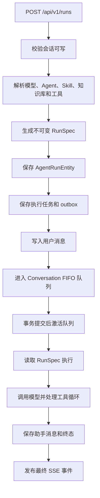

`RunSpec` 是新手必须理解的设计：

> 创建 Run 时把 Agent 提示词、模型能力、Skill 摘要、工具 binding、节点、工作目录和 Actor 摘要固定下来。

这样管理员后来修改模型或工具目录，也不会悄悄改变已经排队的 Run。

### 7.1 会话 FIFO 队列

同一会话中的消息必须按发送顺序执行，否则后一条消息可能在前一条消息还没写入助手答案
之前就开始调用模型。不同会话之间仍然可以并行。

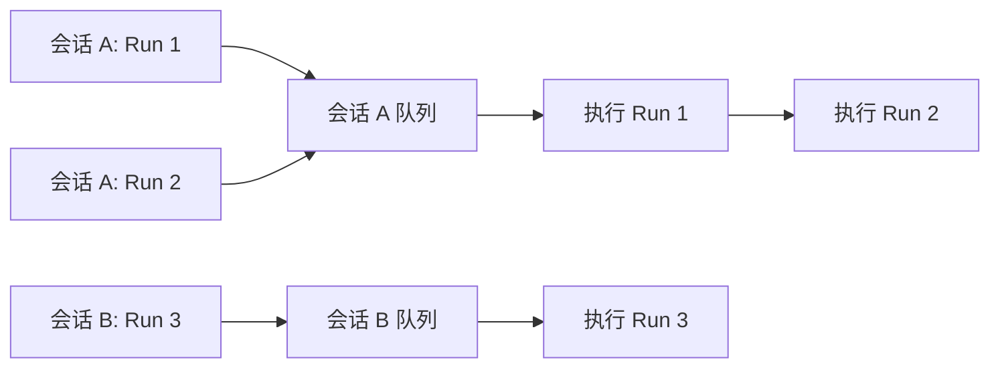

### 7.2 SSE 事件

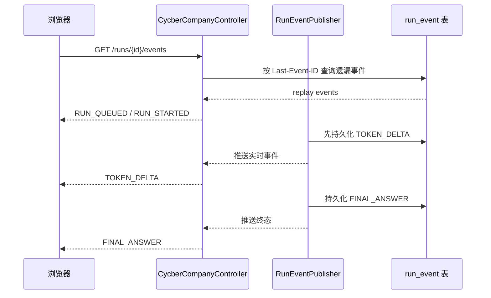

事件“先保存、后推送”，所以浏览器断线后可以带 `Last-Event-ID` 补发，而不是只能重新发起一次模型请求。

## 8. 模型模块

模型模块解决“调用哪个模型、模型支持什么能力、密钥从哪里取”。

主要类：

- `ModelProfileEntity`：模型配置；
- `ModelCatalog`：模型列表、默认模型、启用/禁用；
- `ModelGateway`：统一调用接口；
- `OpenAiCompatibleModelGateway`：OpenAI-compatible HTTP 实现；
- `ModelCapability`：`TEXT`、`VISION`、`TOOLS` 等能力标签。

选择顺序：

```text
请求显式 modelProfileId
    -> Agent 默认模型
    -> 系统默认模型
```

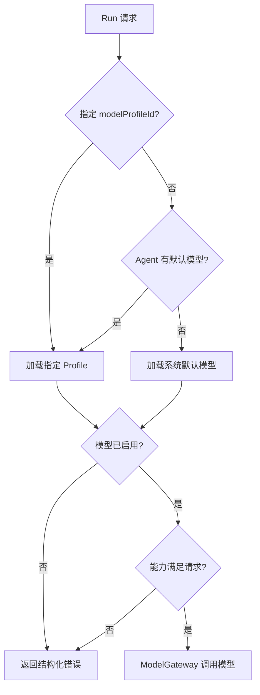

不要把 API Key 放在 `ModelProfileEntity` 的明文字段里。配置中保存的是环境变量名，
真正调用时由网关读取环境变量。

## 9. 工具模块和权限交集

模型不能直接决定“执行哪个节点”或“连接哪个 MCP Server”。工具调用必须经过：

1. Provider 上报事实能力；
2. `ToolRouter` 发现工具；
3. Agent 工具白名单过滤；
4. 本次 Run 的 `toolNames` 再过滤；
5. 解析成固定的 `ResolvedToolBinding`；
6. 需要时创建审批记录；
7. 最后调用 Provider。

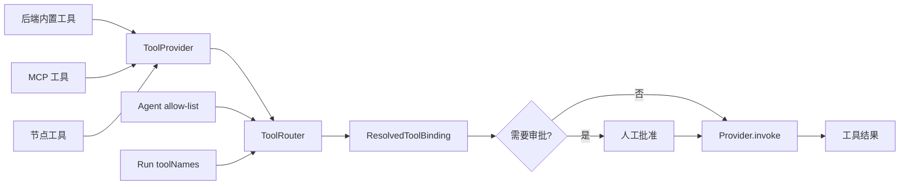

核心原则：

- 工具集合只能缩小，不能因为模型自报能力而扩大；
- binding 固定 Provider、节点或 MCP connection；
- 工具参数只能填写 schema 允许的业务参数；
- 高风险工具不应该自动重试；
- 工具调用需要审计，敏感参数应脱敏。

适合新手的阅读点是 `ToolRouter.resolve`：先理解“发现”，再理解“过滤”，最后理解“绑定”。

## 10. 知识库和 RAG

知识库有两个不同阶段：

- 写入：上传文档、抽取文本、标准化、切块、生成向量、保存；
- 查询：根据 ActorContext 做权限过滤，再检索并返回证据。

导入流程：

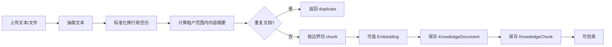

查询流程：

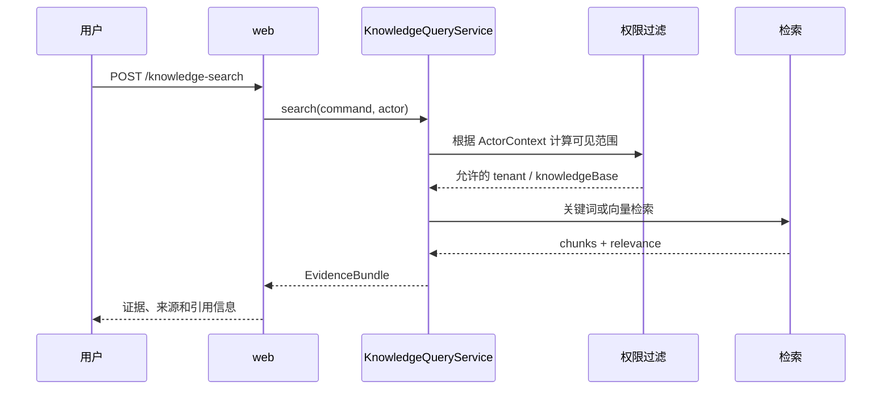

模型、客户端和请求 JSON 都不能覆盖 `tenantId`。权限过滤必须在检索前发生。

## 11. Skill

Skill 是一组声明式 Markdown 指令和可选资源，不等同于 Java 工具。

安装流程：

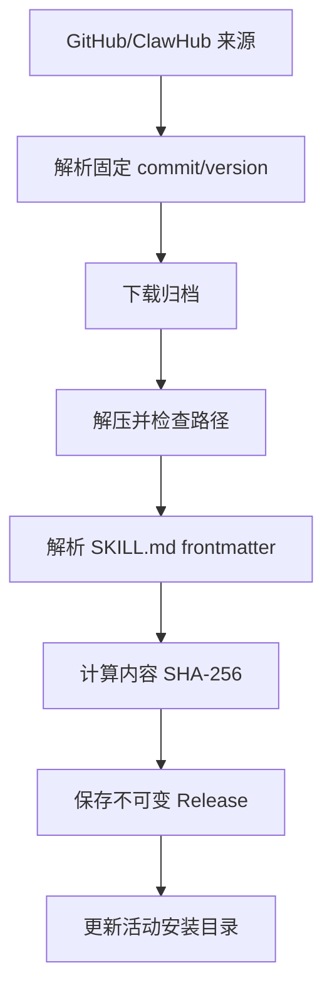

Run 使用 Skill 时：

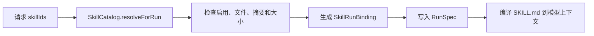

安全边界：

- 安装 Skill 不会自动运行脚本；
- Run 使用的是不可变 Release，不是随时变化的活动目录；
- 读取 `references/templates/assets` 也要经过白名单；
- 脚本执行必须显式启用受限运行时。

## 12. MCP

MCP 是外部工具或知识服务的协议边界。

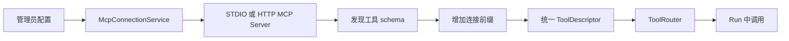

为什么要增加前缀？假设两个 MCP Server 都有 `search`，直接暴露会发生名称冲突。
项目会生成类似：

```text
github__search_issues
filesystem__read_file
```

MCP 连接本身不应该绕过项目的租户、审批和审计规则。

## 13. 节点执行器

节点执行器是独立的 Java 21 子项目，位于 `cycbercompany-node-java`。
后端保存节点信息和权限，节点进程拥有真实本机权限，所以这是最需要认真阅读安全注释的部分。

注册流程：

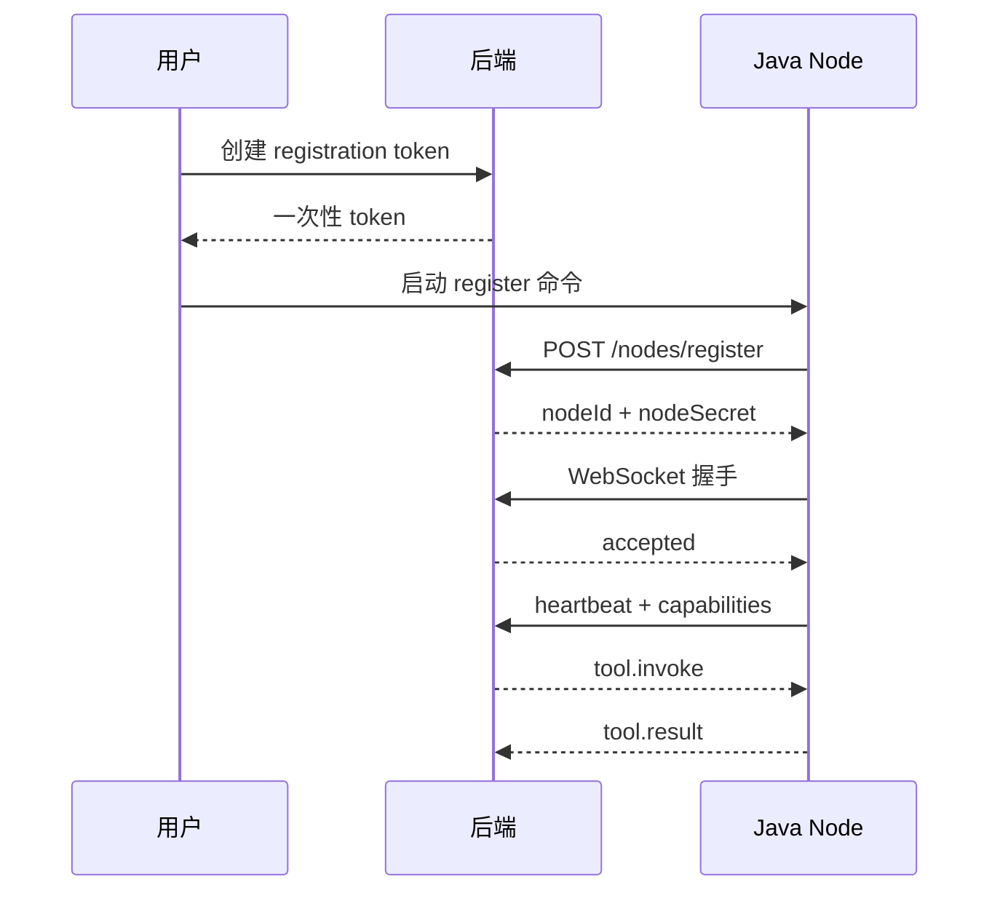

一次工具调用：

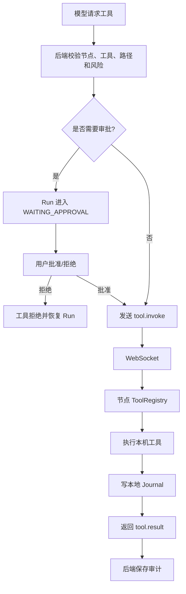

重要提醒：

> `--workspace` 只限制项目工具接受的路径，不是操作系统级沙箱。

运行不可信代码时应该使用低权限账户、容器、虚拟机或 Windows Sandbox。

## 14. Artifact

截图、Trace、下载文件等不适合直接塞进 WebSocket 结果。节点先上传 Artifact，
后端返回摘要和下载引用。

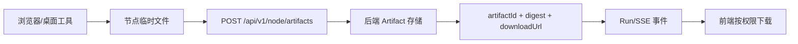

## 15. 配置、持久化和事务

新手看 Service 方法时，重点观察三个东西：

- `@Transactional`：这段数据库操作是否需要一个事务；
- `@Transactional(readOnly = true)`：只读查询是否明确标记；
- `ActorContext`：这次操作属于哪个租户和用户。

典型数据流：

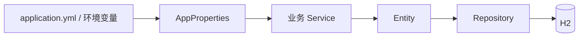

不要在 Controller 里直接 `new Entity` 并保存。推荐路径是：

```text
Controller -> Application Service -> Repository -> Entity
```

这样事务、租户校验和领域规则不会散落在多个入口。

## 16. 测试怎么读

测试文件名通常和生产类对应：

| 测试 | 学习重点 |
|---|---|
| `ConversationServiceTest` | 会话创建、归档和消息追加 |
| `ConversationRunQueueTest` | 同一会话 FIFO、不同会话并行 |
| `CodingAgentLoopTest` | 模型和工具循环 |
| `RunExecutionModeTest` | 执行模式和节点选择 |
| `NodeServiceApprovalTest` | 节点工具审批 |
| `NodeSessionRegistryProtocolTest` | WebSocket 会话和协议 |
| `ToolRouterTest` | 工具发现、白名单和名称冲突 |
| `KnowledgeCommandServiceTest` | 文档切块、重复导入和重建 |
| `SkillCatalogTest` | Skill frontmatter、摘要和 Release |
| `CycberCompanyModularityTest` | Spring Modulith 模块依赖 |

推荐的学习方式：

1. 先读测试的 Given/When/Then；
2. 找到被调用的 Service 方法；
3. 再回到 Entity 看状态变化；
4. 最后看 Controller 或 Repository 如何接入。

## 17. 新手练习路线

### 练习一：增加一个只读 API

例如给某个模块增加统计接口：

1. 找到已有 View；
2. 在 Service 中增加查询方法；
3. 在 Controller 中添加 `@GetMapping`；
4. 加一个带租户校验的测试；
5. 运行 `.\gradlew.bat test`。

### 练习二：增加一个低风险后端工具

1. 定义工具描述；
2. 实现 `ToolProvider`；
3. 在 `ToolRouterTest` 中验证白名单；
4. 确认工具结果有大小限制；
5. 在 Run 中观察 `TOOL_CALL_REQUESTED` 和 `TOOL_RESULT` 事件。

### 练习三：增加一个文档格式

1. 在 `KnowledgeCommandService.extractText` 中接入解析器；
2. 增加空文本、异常格式和重复摘要测试；
3. 确认文档切块仍然带来源信息；
4. 通过 `/knowledge-search` 验证返回 `EvidenceBundle`。

### 练习四：理解节点安全

先不要修改 Shell 执行逻辑，先阅读：

- 后端 `NodeToolRequestPolicy`；
- 后端 `NodeToolPolicyCatalog`；
- 后端 `NodeService`；
- 节点端 `ToolRegistry`；
- 节点端 `ShellTool` 和 `FileTool`。

回答三个问题后再改代码：

1. 谁决定工具是否需要审批？
2. 谁决定路径是否允许？
3. 节点断线时为什么不能自动重放副作用调用？

## 18. 常见误区

### 把 Controller 当成业务层

Controller 只是 HTTP 适配器。复杂逻辑应该放到对应模块的 Service。

### 把 Entity 当成 API DTO

Entity 会随着数据库设计变化，不应该直接暴露给前端。项目使用 `View`、`Command` 和 `Result`
来隔离输入、输出和持久化模型。

### 认为 202 表示成功完成

Run 的 202 只表示“已经保存并排队”。最终结果要读 Run 状态或 SSE 事件。

### 把 Skill 当成工具

Skill 主要提供模型指令和资源；Tool 才是一次可调用的动作。Skill 是否能使用某个 Tool，
还要经过兼容性检查和 Run 的工具交集。

### 认为 workspace 是沙箱

workspace 是应用层路径约束，不会替代操作系统权限。

## 19. 一张总图

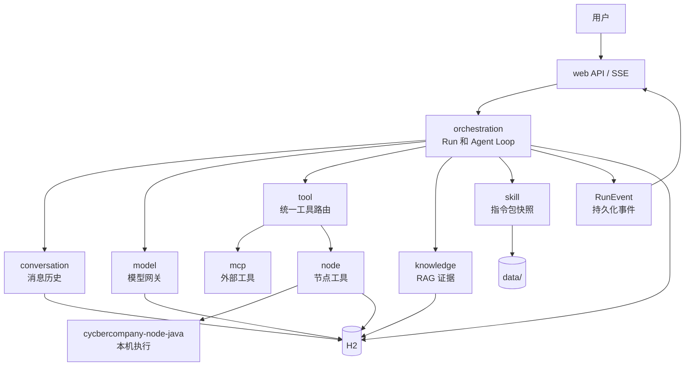

如果你能解释这张图中每条箭头的方向，就已经掌握了项目的主要骨架。
