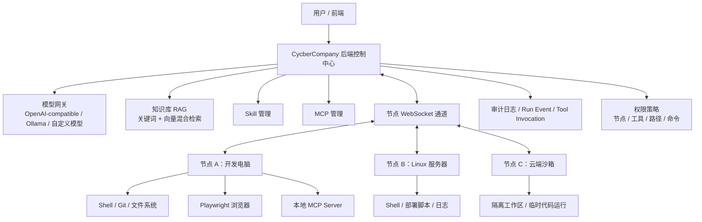
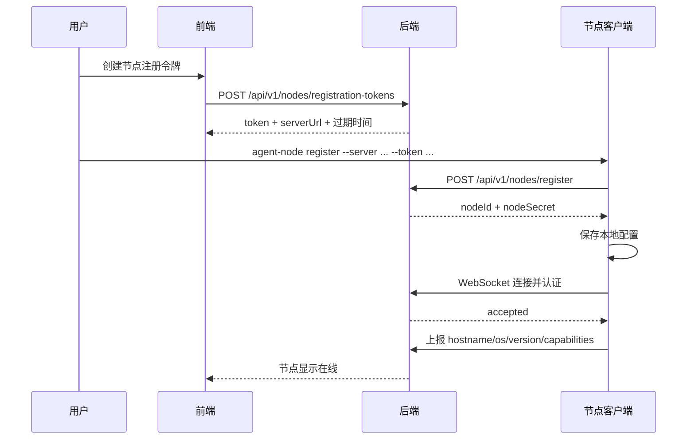
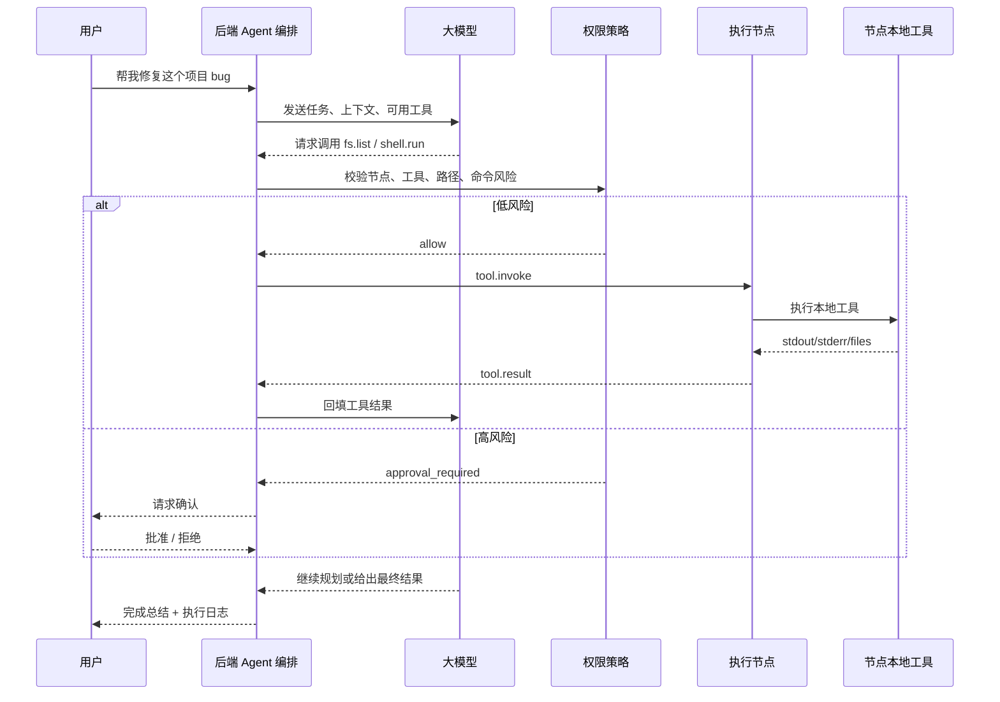
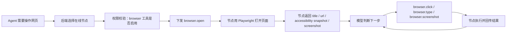
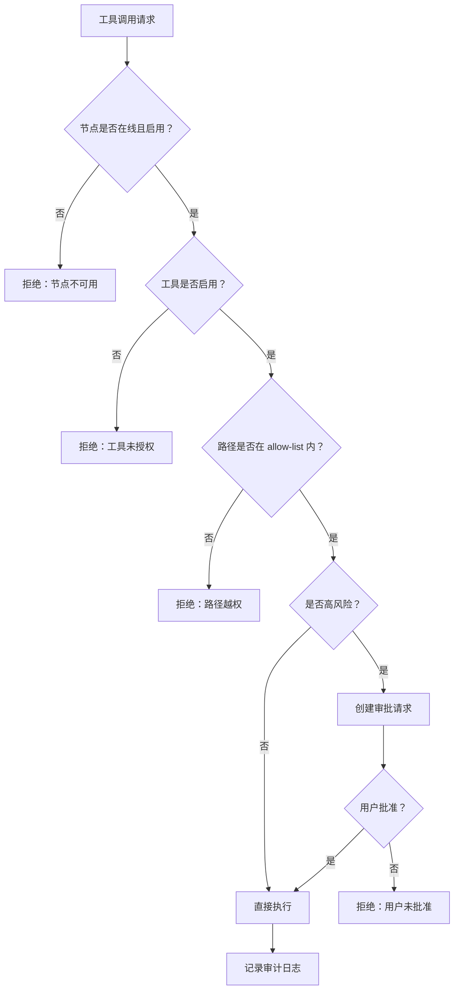
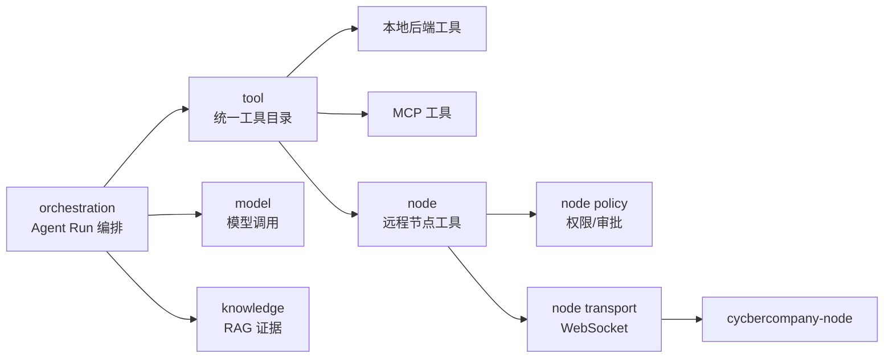

# 节点执行架构设计：让 Agent 控制电脑和服务器干活

## 目标

把当前 CycberCompany 从“后端自己拥有工具”升级为“控制中心 + 多执行节点”的平台架构。

后端负责：用户、模型、Agent 编排、权限、任务状态、日志、审计、节点管理。  
节点负责：在自己的电脑或服务器上执行命令、操作文件、运行浏览器、访问本地项目、连接本地 MCP。

这样做的核心好处：

- 后端不需要直接拥有用户电脑权限；
- Windows、macOS、Linux、服务器都可以作为执行节点接入；
- 本地项目、本地浏览器登录态、本机文件都留在节点侧；
- 企业部署时可以按节点、路径、工具、用户进行细粒度授权；
- 将来可以同时支持“本地电脑节点”和“云端沙箱节点”。

## 技术选型结论

### 后端控制中心

继续使用当前 Spring Boot 后端。

理由：

- 当前项目已经用 Spring Boot、JPA、Modulith、H2 数据库完成了模型、MCP、Skill、知识库等核心模块；
- 节点管理天然属于后端业务能力，适合接入现有用户、租户、审计、Run 事件体系；
- WebSocket、SSE、REST、JPA 都有成熟生态。

后端新增模块建议命名为：

```text
node
```

主要职责：

- 节点注册；
- 节点认证；
- 节点心跳；
- 节点能力声明；
- 节点启用/禁用；
- 节点工具启用/禁用；
- 节点任务下发；
- 节点执行结果回传；
- 节点执行日志和审计。

### 节点客户端

第一版使用 Java 21。

理由：

- 和后端同为 Java 技术栈，协议模型、日志、配置和打包方式更统一；
- Java 21 的 HttpClient WebSocket、Process API 和虚拟线程适合长期驻留节点；
- 更容易做成 Windows Service、systemd 服务或企业内网常驻进程；
- 本地 shell、文件、git、权限策略等能力用 Java 实现更稳；
- 浏览器自动化可通过 Playwright Java 接入，虽然不如 Node 生态轻快，但足够支撑第一版。

第一版节点客户端建议目录：

```text
cycbercompany-node-java/
  src/
    CycberCompanyNodeApplication.java
    NodeConfig.java
    transport/
      NodeWebSocketClient.java
    tools/
      ShellTool.java
      FilesystemTool.java
      GitTool.java
      BrowserTool.java
    security/
      PermissionGuard.java
      PathPolicy.java
      CommandPolicy.java
    runtime/
      TaskRunner.java
      ToolRegistry.java
```

### 通信协议

第一版使用 WebSocket + JSON-RPC 风格消息。

原因：

- 节点通常在家庭电脑、办公室电脑、内网服务器后面，后端主动连节点不稳定；
- 节点主动连后端 WebSocket，可以自然穿过大部分 NAT；
- 后端可以通过同一个长连接下发任务，节点可以实时回传日志；
- JSON-RPC 风格简单，和 MCP 的思路也比较接近。

协议方向：

```text
节点 -> 后端：注册、心跳、能力上报、执行结果、日志
后端 -> 节点：工具调用、取消任务、刷新策略、断开连接
```

### 浏览器自动化

第一版使用 Playwright，不做鼠标坐标级桌面控制。

原因：

- Playwright 通过 DOM、selector、accessibility tree 控制页面，比视觉坐标稳定；
- 适合本项目常见场景：打开本地前端、点击按钮、输入内容、截图、获取页面结构、做前后端联调；
- 桌面视觉控制风险更高，放到第二阶段。

### 本地命令执行

第一版支持受限 shell。

不是直接开放任意命令，而是按策略控制：

- 限定工作目录；
- 限定最大执行时长；
- 限定输出大小；
- 高风险命令需要审批；
- 默认禁止系统目录、用户主目录、磁盘根目录的破坏性操作。

### 文件系统

第一版支持工作区内文件操作。

建议工具：

- `fs.list`
- `fs.read`
- `fs.write`
- `fs.apply_patch`
- `fs.move`
- `fs.mkdir`

删除类能力先不默认开放。确实需要时，优先做“移动到回收站/备份目录”，并要求用户确认。

### Git

第一版支持项目开发必要命令：

- `git.status`
- `git.diff`
- `git.branch`
- `git.log`
- `git.commit`

不默认开放：

- `git reset --hard`
- 强推；
- 清理未跟踪文件；
- 删除分支。

## 总体架构图



## 节点注册流程



## Agent 执行节点工具流程



## 浏览器控制流程



## 权限与审批流程



## 后端数据模型建议

### node_connection

记录节点基础信息。

| 字段 | 说明 |
|---|---|
| id | 节点 ID |
| tenant_id | 租户 |
| name | 用户给节点起的名字 |
| hostname | 主机名 |
| os_name | 操作系统 |
| os_arch | CPU 架构 |
| client_version | 节点客户端版本 |
| enabled | 节点是否启用 |
| status | ONLINE / OFFLINE / DISABLED |
| last_seen_at | 最近心跳时间 |
| created_at | 创建时间 |

### node_capability

记录节点声明的能力。

| 字段 | 说明 |
|---|---|
| id | 主键 |
| node_id | 节点 ID |
| name | 能力名，例如 shell、filesystem、browser、git |
| enabled | 后端是否允许使用 |
| risk_level | LOW / MEDIUM / HIGH |

### node_tool_policy

记录工具级策略。

| 字段 | 说明 |
|---|---|
| id | 主键 |
| node_id | 节点 ID |
| tool_name | 工具名，例如 shell.run |
| enabled | 是否启用 |
| require_approval | 是否需要审批 |
| timeout_seconds | 超时时间 |
| max_output_bytes | 最大输出 |

### node_path_policy

记录路径白名单。

| 字段 | 说明 |
|---|---|
| id | 主键 |
| node_id | 节点 ID |
| path | 允许访问的本地路径 |
| mode | READ_ONLY / READ_WRITE |

### node_tool_invocation

记录每次节点工具调用。

| 字段 | 说明 |
|---|---|
| id | 调用 ID |
| run_id | 关联 Agent Run |
| node_id | 执行节点 |
| tool_name | 工具名 |
| input_summary | 输入摘要，避免记录敏感全文 |
| status | PENDING / RUNNING / SUCCEEDED / FAILED / CANCELLED |
| started_at | 开始时间 |
| finished_at | 结束时间 |
| exit_code | 命令退出码 |
| output_preview | 输出预览 |
| error_message | 错误信息 |

## 节点工具协议草案

### 节点连接认证

节点连接 WebSocket 后发送：

```json
{
  "type": "node.hello",
  "messageId": "msg-1",
  "nodeId": "node_abc",
  "timestamp": "2026-07-30T08:00:00Z",
  "signature": "hmac-sha256(...)"
}
```

后端返回：

```json
{
  "type": "node.accepted",
  "messageId": "msg-1",
  "heartbeatIntervalSeconds": 20
}
```

### 节点能力上报

```json
{
  "type": "node.capabilities",
  "messageId": "msg-2",
  "capabilities": [
    {
      "name": "shell.run",
      "riskLevel": "HIGH",
      "inputSchema": {
        "type": "object",
        "properties": {
          "command": { "type": "string" },
          "cwd": { "type": "string" },
          "timeoutSeconds": { "type": "integer" }
        },
        "required": ["command"]
      }
    },
    {
      "name": "fs.read",
      "riskLevel": "LOW"
    },
    {
      "name": "browser.open",
      "riskLevel": "MEDIUM"
    }
  ]
}
```

### 后端下发工具调用

```json
{
  "type": "tool.invoke",
  "messageId": "invoke-123",
  "invocationId": "toolinv_123",
  "runId": "run_123",
  "toolName": "shell.run",
  "arguments": {
    "command": "./gradlew.bat test",
    "cwd": "D:/ai/cycbercompany-backend",
    "timeoutSeconds": 120
  }
}
```

### 节点返回执行结果

```json
{
  "type": "tool.result",
  "messageId": "result-123",
  "replyTo": "invoke-123",
  "invocationId": "toolinv_123",
  "status": "SUCCEEDED",
  "result": {
    "exitCode": 0,
    "stdout": "BUILD SUCCESSFUL",
    "stderr": "",
    "durationMs": 13000
  }
}
```

## 工具分级

### 第一阶段必须实现

| 工具 | 风险 | 用途 |
|---|---:|---|
| `node.info` | 低 | 查看节点系统信息 |
| `fs.list` | 低 | 列目录 |
| `fs.read` | 低 | 读文件 |
| `fs.write` | 中 | 写文件 |
| `fs.apply_patch` | 中 | 代码修改 |
| `shell.run` | 高 | 执行命令 |
| `git.status` | 低 | 查看仓库状态 |
| `git.diff` | 低 | 查看改动 |
| `browser.open` | 中 | 打开网页 |
| `browser.snapshot` | 低 | 读取页面结构 |
| `browser.screenshot` | 低 | 截图 |
| `browser.click` | 中 | 点击 |
| `browser.type` | 中 | 输入 |

### 第二阶段再实现

| 工具 | 原因 |
|---|---|
| `fs.delete` | 风险高，需要回收站/审批/恢复机制 |
| `desktop.screenshot` | 需要处理隐私和敏感信息 |
| `desktop.click` | 坐标级操作不稳定 |
| `desktop.type` | 可能误输入到错误窗口 |
| `deploy.run` | 需要生产环境权限体系 |

## 与现有模块的关系



后端不应该让 `orchestration` 直接操作 WebSocket。  
正确边界是：

```text
orchestration -> ToolCatalog -> NodeToolAdapter -> NodeConnectionService -> WebSocket session
```

这样 Agent 只知道“有一个工具可以调用”，不需要知道工具是在本进程、MCP、还是远程节点上。

## 实现里程碑

### N1：节点注册与在线状态

后端：

- `POST /api/v1/node-registration-tokens`
- `POST /api/v1/nodes/register`
- `GET /api/v1/nodes`
- `GET /api/v1/nodes/{id}`
- `PATCH /api/v1/nodes/{id}`
- `DELETE /api/v1/nodes/{id}`
- `WS /api/v1/node-channel`

节点：

- `agent-node register`
- 保存 `nodeId`、`nodeSecret`、`serverUrl`
- 建立 WebSocket
- 心跳
- 能力上报

验收：

- 前端/接口能看到节点在线/离线；
- 关闭节点进程后，后端能在超时时间内标记离线；
- 禁用节点后，即使 WebSocket 在线也不能执行工具。

### N2：节点工具注册与管理

后端：

- 保存节点工具；
- 支持工具启用/禁用；
- 支持工具风险等级；
- 支持工具 schema；
- `/api/v1/tools` 聚合节点工具。

验收：

- 同一节点的 `shell.run` 可以单独禁用；
- 不同节点的同名工具不会冲突，工具名可以显示为 `node:{nodeId}:shell.run`；
- Agent 只能看到已启用工具。

### N3：文件和 Shell 执行

后端：

- 下发 `fs.list`、`fs.read`、`fs.write`、`fs.apply_patch`、`shell.run`；
- 记录 `node_tool_invocation`；
- 支持超时和取消。

节点：

- 执行文件工具；
- 执行受限 shell；
- 输出截断；
- 路径白名单校验。

验收：

- Agent 可以读取指定项目文件；
- Agent 可以修改代码；
- Agent 可以运行测试；
- 越权路径被拒绝；
- 高风险命令进入审批。

### N4：浏览器自动化

后端：

- 下发 browser 工具调用；
- 保存截图元数据；
- Run Event 显示浏览器动作。

节点：

- Playwright 打开浏览器；
- 返回页面标题、URL、DOM 摘要、截图；
- 支持 click/type。

验收：

- Agent 可以打开本地前端；
- 可以点击、输入、截图；
- 可以把页面错误反馈给模型继续修代码。

### N5：Agent 编程闭环

目标场景：

```text
用户：在节点 office-pc 上修复 D:\ai\project 的测试失败
Agent：
1. fs.list
2. fs.read
3. fs.apply_patch
4. shell.run test
5. 根据测试错误继续修改
6. git.diff
7. 输出总结
```

验收：

- 不需要人工复制错误日志；
- Agent 能在同一个 Run 里多轮调用节点工具；
- 所有工具调用都有审计记录；
- 高风险操作不会绕过审批。

## 安全原则

1. 节点主动连接后端，后端不扫描局域网；
2. 节点 token 短期有效，注册后使用 nodeSecret；
3. nodeSecret 只存哈希或加密后的形式；
4. 路径权限默认空，用户必须显式添加 allow-list；
5. 写操作默认中风险，shell 默认高风险；
6. 删除、系统目录、磁盘根目录操作默认禁止；
7. 工具入参和输出要做敏感信息裁剪；
8. 每次工具调用都必须记录审计日志；
9. 节点禁用后不能执行任何工具；
10. 浏览器登录态属于节点本地敏感资产，必须按节点授权使用。

## 推荐第一版取舍

先不要做：

- 视觉级桌面控制；
- 任意文件删除；
- 生产部署命令；
- 多租户共享同一个节点；
- 复杂工作流市场。

先做：

- 节点注册；
- 节点在线状态；
- 工具声明；
- 工具启用/禁用；
- 文件读写；
- shell 执行；
- git 状态；
- Playwright 浏览器；
- 执行日志；
- 审批钩子。

这条路线能最快让产品从“聊天 + 工具管理”进入“Agent 真的能在我的电脑/服务器上干活”。
